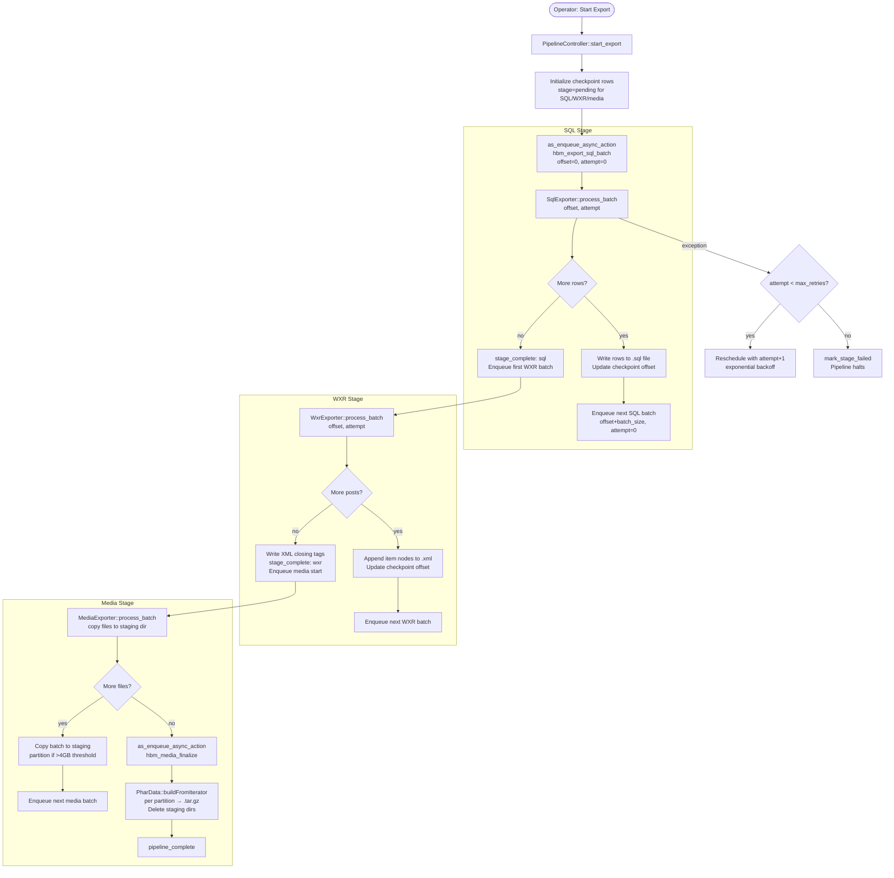
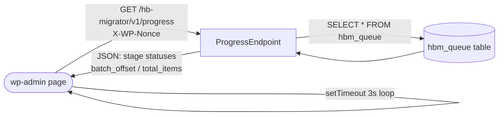

# feat: Build hb-migrator async export queue plugin

## Summary

Build the hb-migrator WordPress plugin from scratch. The plugin installs on a source self-hosted site and runs a three-stage export pipeline — SQL database dump, WXR post export, and media archive packaging — as an Action Scheduler–backed async background queue. Each stage checkpoints per-batch progress to a custom database table; failed batches self-retry with exponential backoff; a wp-admin page polls a REST endpoint for live progress. The operator downloads the resulting files and runs `vip import sql` / `vip import media` separately on the destination environment.

---

## Problem Frame

PHP's 60-second HTTP timeout and memory limits are hard ceilings on shared and managed hosting. Synchronous migration runs silently fail at whatever percentage they reached when the timeout fires. On sites with tens of thousands of posts or gigabytes of media, there is no workaround within a synchronous HTTP request.

An async queue decouples export duration from HTTP server limits. A 5-second batch of 500 posts safely clears any timeout. Persisted checkpoint state converts a mid-run failure from a catastrophe into a resumable position. (see origin: `docs/brainstorms/2026-06-22-async-export-queue-requirements.md`)

---

## Requirements

**Queue behavior**

- R1. The plugin manages the export pipeline as a persistent background queue backed by Action Scheduler, bundled as a vendor dependency.
- R2. A single "Start Export" action triggers the full pipeline; stages sequence automatically (SQL → WXR → media) without further operator input.
- R3. Each batch completes well under the 60-second HTTP timeout.
- R4. Each stage persists checkpoint state; interrupted work resumes from the last completed batch offset.
- R5. Failed batches retry automatically up to a configurable limit (default: 3). Exhausted retries mark the stage failed, halt the pipeline, and surface an error + "Retry Stage" action.
- R6. A "Reset Export" action clears all queue state and deletes partial artifacts.

**Export stages**

- R7. The SQL stage produces a MySQL-compatible dump: InnoDB-only, `wp_` prefix, no `ALTER TABLE`, no triggers, no `ENGINE=MyISAM`.
- R8. The WXR stage streams post content in configurable batch sizes (default: 500), never loading the full document into memory.
- R9. The media stage produces a `.tar.gz` archive with `{year}/{month}/` structure at root (no `uploads/` parent).
- R10. If total media volume exceeds 4 GB, the media stage produces multiple archives, each under 4 GB.

**Multisite**

- R11. In multisite mode, the SQL stage excludes network-level tables (`wp_users`, `wp_usermeta`, `wp_blogs`, `wp_site`, `wp_registration_log`, `wp_signups`, `wp_sitemeta`), rewrites table prefixes to `wp_{blog_id}_`, and rewrites `user_roles` option inserts to use the blog-prefixed option key.
- R12. In multisite mode, the media stage rewrites upload paths from `wp-content/uploads/` to `wp-content/uploads/sites/{blog_id}/`.

**Security and access**

- R13. Export artifacts are protected from direct URL access via `.htaccess` deny rules immediately on directory creation.
- R14. Artifacts are served only to authenticated administrators through a wp-admin download gateway.

**Progress UI**

- R15. A wp-admin page polls the checkpoint table via a REST endpoint and displays per-stage progress counts.
- R16. When a stage fails, the UI shows the error message and a "Retry Stage" action that resumes from the last checkpoint offset.

---

## Key Technical Decisions

**Action Scheduler 3.9.x via git subtree.** Bundle at `lib/action-scheduler/` using `git subtree add`. Git subtree commits the dependency directly without a build step and avoids Composer autoloader conflicts that arise when multiple plugins bundle AS via Composer without PHP-Scoper. AS 3.9.x sets the minimum floor at WordPress 6.4 / PHP 7.1. Initialization is a single `require_once` before `plugins_loaded`; AS registers its version with the central singleton and the highest loaded version wins — no explicit initialization call is needed.

**Application-level retry via attempt counter.** Action Scheduler marks a failed action as `failed` and moves on — it does not natively re-dispatch on exception. Retry logic lives in each batch callback: the attempt count travels as an action parameter. On exception, the callback reschedules the same action with `$attempt + 1` and exponential backoff (60s, 120s, 240s). When the attempt count reaches the configured limit, the callback marks the stage failed in the checkpoint table and dispatches nothing further.

**Chain dispatch pattern.** Each batch callback does its work, updates the checkpoint offset, then enqueues the next batch action. No upfront pre-scheduling. This keeps the AS queue narrow at any given moment, makes progress directly observable from the checkpoint table, and lets the offset-based resume work correctly: a resumed run simply re-enqueues from the saved offset rather than hunting for a specific AS action.

**Single checkpoint table with one row per stage.** A dedicated `{prefix}hbm_queue` table tracks `stage`, `status`, `batch_offset`, `total_items`, `attempt_count`, and `error_message`. The progress REST endpoint reads this table directly — not the AS `actionscheduler_actions` table — keeping the UI query fast and independent of AS internals.

**WXR incremental append via fopen 'a'.** The WXR stage uses `fopen()` in append mode across invocations. The first batch writes the XML envelope header; subsequent batches append item nodes; the final batch (empty post query) appends the closing tags. The checkpoint tracks whether the header has been written. `WP_Filesystem` is not used for this path — it requires an admin context and FTP credential prompts that are unavailable inside an AS action.

**PharData staging approach for media archives.** Media batch actions copy files to a staging directory preserving `{year}/{month}/` structure. A finalize action calls `PharData::buildFromIterator()` once across the entire staging directory and compresses with `Phar::GZ`. This avoids the O(n²) rewrite behavior of per-file `addFile()` calls. The 4 GB split is implemented during staging: when the next file would push the current partition's cumulative size over the threshold, batch actions begin writing to a new partition directory. The finalize action builds one archive per partition. Staging directories are deleted after successful archive creation.

**PHP download gateway, `.htaccess` as defense-in-depth.** Export artifacts are served through a wp-admin handler that verifies `current_user_can('manage_options')` and streams files via `fread()` — this works on both Apache and Nginx. `.htaccess` deny rules (written via `insert_with_markers()`) block direct URL access on Apache/LiteSpeed hosts as a second layer. An `index.php` stub is also written to the export directory as a third layer.

**Multisite `wp_user_roles` option rewrite.** The deploy-to-vip reference documents that `wp_options` INSERT statements containing the `user_roles` option key must be rewritten to `wp_{blog_id}_user_roles` during multisite prefix transformation. This is not captured in the origin R11 prose but is required for correct VIP import behavior and is carried into the SQL exporter's multisite path.

---

## High-Level Technical Design





---

## Output Structure

```
hb-migrator/
├── hb-migrator.php                         # Plugin entry point, AS include, autoloader
├── includes/
│   ├── class-plugin.php                    # Singleton: hooks registration, activation
│   ├── class-checkpoint.php                # Read/write interface for hbm_queue table
│   ├── class-queue-table.php               # dbDelta schema, version management
│   ├── class-pipeline-controller.php       # Stage sequencing, retry orchestration
│   ├── class-multisite-handler.php         # Detection, prefix rewriting, path rewriting
│   ├── class-artifact-manager.php          # Export directory creation, .htaccess, cleanup
│   ├── exporters/
│   │   ├── class-sql-exporter.php          # SQL dump stage
│   │   ├── class-wxr-exporter.php          # WXR streaming stage
│   │   └── class-media-exporter.php        # Media staging + finalize stage
│   └── admin/
│       ├── class-admin-page.php            # wp-admin page, Start/Retry/Reset actions
│       ├── class-progress-endpoint.php     # REST endpoint for polling
│       └── class-download-handler.php      # Authenticated file streaming gateway
├── assets/
│   ├── js/admin.js                         # Polling loop, progress UI updates
│   └── css/admin.css                       # Progress bar, status indicator styles
├── lib/
│   └── action-scheduler/                   # git subtree (woocommerce/action-scheduler 3.9.x)
└── tests/
    ├── test-checkpoint.php
    ├── test-pipeline-controller.php
    ├── test-sql-exporter.php
    ├── test-wxr-exporter.php
    ├── test-media-exporter.php
    ├── test-multisite-handler.php
    ├── test-artifact-manager.php
    └── test-admin-page.php
```

---

## Implementation Units

### U1. Plugin scaffold and activation

**Goal:** Establish the plugin entry point, PSR-4-style autoloader, constants, and activation/deactivation hooks.

**Requirements:** R1 (plugin registers with AS on load), R6 (deactivation does not delete data — data persists for resume across deactivation/reactivation cycles).

**Dependencies:** none.

**Files:**
- `hb-migrator.php` (create)
- `includes/class-plugin.php` (create)

**Approach:** Plugin header declares `Requires at least: 6.4` and `Requires PHP: 7.1`. A `spl_autoload_register` closure maps the `HBMigrator\` namespace to `includes/`. `register_activation_hook` fires table creation (U2) and export directory creation (U9). Deactivation hook cancels all pending AS actions in the `hb-migrator` group via `as_unschedule_all_actions()` but leaves the checkpoint table and any existing artifacts untouched. Plugin singleton registered on `plugins_loaded` at default priority so AS has loaded first.

**Patterns to follow:** Standard WordPress plugin header conventions; `spl_autoload_register` over `require_once` chains.

**Test scenarios:**
- Plugin file passes `validate_plugin()` without errors.
- Activation does not produce PHP errors or warnings.
- Deactivation cancels pending AS actions but does not truncate the checkpoint table.
- Constants `HBM_VERSION`, `HBM_PLUGIN_DIR`, `HBM_PLUGIN_URL` are defined after load.

---

### U2. Checkpoint database table

**Goal:** Create and maintain the `{prefix}hbm_queue` table that stores per-stage export state. Provide a typed read/write interface for all queue operations.

**Requirements:** R4 (checkpoint persistence), R5 (attempt count, error message, status), R15 (progress counts), R16 (error surfacing).

**Dependencies:** U1.

**Files:**
- `includes/class-queue-table.php` (create)
- `includes/class-checkpoint.php` (create)
- `tests/test-checkpoint.php` (create)

**Approach:** `QueueTable` runs `dbDelta()` on activation and on `plugins_loaded` when `hbm_db_version` option does not match `HBM_DB_VERSION`. Schema:

```
id             bigint(20) UNSIGNED NOT NULL AUTO_INCREMENT
stage          varchar(32) NOT NULL
status         varchar(16) NOT NULL DEFAULT 'pending'
batch_offset   bigint(20) UNSIGNED NOT NULL DEFAULT 0
total_items    bigint(20) UNSIGNED NOT NULL DEFAULT 0
attempt_count  tinyint(3) UNSIGNED NOT NULL DEFAULT 0
error_message  text
updated_at     datetime NOT NULL DEFAULT CURRENT_TIMESTAMP ON UPDATE CURRENT_TIMESTAMP
PRIMARY KEY  (id)
KEY stage (stage)
```

`Checkpoint` wraps `$wpdb` calls and exposes: `initialize_stages()`, `get_stage(string $stage): object`, `set_offset(string $stage, int $offset)`, `set_total(string $stage, int $total)`, `mark_stage_complete(string $stage)`, `mark_stage_failed(string $stage, string $error)`, `increment_attempt(string $stage)`, `reset_all()`, `get_all_stages(): array`.

**Patterns to follow:** `dbDelta()` strict formatting (two spaces before `PRIMARY KEY`, `KEY` not `INDEX`, lowercase type names with explicit lengths). Always use `$wpdb->prepare()` for parameterized queries.

**Test scenarios:**
- Table created on first activation; columns match schema.
- `initialize_stages()` inserts three rows (sql, wxr, media) with status `pending`.
- `set_offset('sql', 500)` updates `batch_offset` for the sql stage only.
- `mark_stage_failed('wxr', 'OOM error')` sets status to `failed` and populates `error_message`.
- `get_all_stages()` returns all three stage rows.
- `reset_all()` deletes all rows.
- Schema upgrade increments `hbm_db_version` option.

---

### U3. Action Scheduler vendor bundle

**Goal:** Bundle Action Scheduler 3.9.x via git subtree and initialize it correctly so the "best version wins" loader operates.

**Requirements:** R1 (AS as the queue backend).

**Dependencies:** U1.

**Files:**
- `lib/action-scheduler/` (git subtree — not hand-written)
- `hb-migrator.php` (modify: add `require_once`)

**Approach:** Add the subtree with:
```
git subtree add --prefix lib/action-scheduler \
  https://github.com/woocommerce/action-scheduler.git \
  3.9.x --squash
```
In `hb-migrator.php`, before any other includes:
```php
require_once __DIR__ . '/lib/action-scheduler/action-scheduler.php';
```
This must appear before `plugins_loaded` priority 1. Action hooks for AS actions are registered inside a callback on `action_scheduler_init` to ensure AS is fully loaded before the hooks are attached. All AS calls use the group `'hb-migrator'` for scoped cancellation and admin visibility.

**Patterns to follow:** Action Scheduler [official bundling docs](https://actionscheduler.org/usage/#load-order) — include before `plugins_loaded`; no manual `ActionScheduler::initialize()` call.

**Test scenarios:**
- `as_has_scheduled_action('hbm_export_sql_batch')` returns bool without PHP errors after plugin loads.
- AS version from this plugin is registered in `ActionScheduler_Versions`.
- If a second higher version is loaded, AS uses that version (integration scenario).

---

### U4. Export pipeline controller

**Goal:** Orchestrate the three-stage pipeline: initialize, chain stage transitions, implement batch-level retry with exponential backoff, and expose Start/Retry/Reset operations.

**Requirements:** R2 (auto-sequence), R3 (time-bounded batches), R4 (resume), R5 (retry/fail), R6 (reset).

**Dependencies:** U2, U3.

**Files:**
- `includes/class-pipeline-controller.php` (create)
- `tests/test-pipeline-controller.php` (create)

**Approach:**

`start_export()`: guards against a running pipeline (`status = running` in any stage row); calls `Checkpoint::initialize_stages()`; dispatches `hbm_export_sql_batch` with args `[offset => 0, attempt => 0]` using `as_enqueue_async_action(..., unique: true)`.

`handle_batch_failure(string $stage, int $offset, int $attempt, \Throwable $e)`: calls `Checkpoint::increment_attempt()`; if `$attempt < max_retries`, reschedules `hbm_export_{$stage}_batch` with delay `60 * (2 ** $attempt)` seconds via `as_schedule_single_action()`; if exhausted, calls `Checkpoint::mark_stage_failed()`.

`stage_complete(string $stage)`: marks stage done; dispatches the first batch of the next stage (SQL→WXR: dispatch `hbm_export_wxr_batch [0, 0]`; WXR→media: dispatch `hbm_export_media_batch [0, 0]`; media→done: records pipeline complete).

`retry_stage(string $stage)`: validates the stage is currently `failed`; resets its checkpoint row to `pending, offset=current checkpoint offset, attempt=0`; re-dispatches its first batch action.

`reset()`: calls `as_unschedule_all_actions('hb-migrator')`; calls `Checkpoint::reset_all()`; calls `ArtifactManager::delete_all_artifacts()`.

Max retries is filterable: `apply_filters('hbm_max_retries', 3)`.

**Patterns to follow:** `as_enqueue_async_action` with `unique: true` to prevent double-dispatch when start is clicked twice.

**Test scenarios:**
- `start_export()` with no running pipeline initializes three checkpoint rows and enqueues the SQL batch action.
- `start_export()` while a stage is `running` does nothing (idempotent).
- `handle_batch_failure('sql', 0, 0, ...)` reschedules with 60s delay and increments attempt count.
- `handle_batch_failure('sql', 0, 2, ...)` (attempt = max) marks sql stage `failed` and enqueues nothing.
- `stage_complete('sql')` marks sql `complete` and enqueues the first WXR batch.
- `stage_complete('media')` marks pipeline complete.
- `retry_stage('wxr')` resets wxr checkpoint and enqueues first WXR batch.
- `reset()` cancels all pending AS actions and clears checkpoint rows.

---

### U5. SQL export stage

**Goal:** Export the full WordPress database as a VIP-compatible MySQL dump, processing tables in batches.

**Requirements:** R3, R4, R7, R11.

**Dependencies:** U2, U3, U4, U8.

**Files:**
- `includes/exporters/class-sql-exporter.php` (create)
- `tests/test-sql-exporter.php` (create)

**Approach:**

Action hook: `hbm_export_sql_batch` receives `(int $table_index, int $row_offset, int $attempt)`.

Discovery (table_index = 0, row_offset = 0, first invocation): query `information_schema.tables` for all tables with `table_schema = DB_NAME` and the site's `$wpdb->prefix`. In multisite mode, filter through `MultisiteHandler::get_excluded_tables()`. Write table count to checkpoint `total_items`. Write CREATE TABLE statement using `SHOW CREATE TABLE {table}` — strip `ENGINE=MyISAM`, replace with `ENGINE=InnoDB`; strip any `ALTER TABLE` or `CREATE TRIGGER` lines. Begin INSERT batches for the current table.

Row export: `SELECT * FROM {table} LIMIT {batch_size} OFFSET {row_offset}`. Format as multi-row INSERT statements. Write to `{uploads}/hbm-exports/export-{timestamp}.sql` using `fopen('a')`. After exhausting rows for the current table, advance `$table_index` and reset `$row_offset = 0`. Call `PipelineController::stage_complete('sql')` when all tables processed.

Multisite path: for each INSERT line, pass through `MultisiteHandler::rewrite_table_name()`. For option rows where `option_name = 'user_roles'`, rewrite option_name to `wp_{blog_id}_user_roles`.

Exception handling: on any `\Throwable`, call `PipelineController::handle_batch_failure('sql', $table_index, $attempt, $e)` and return without further dispatch.

Batch size is filterable: `apply_filters('hbm_sql_batch_size', 1000)` rows per invocation.

**Patterns to follow:** `$wpdb->get_results()` with `ARRAY_A`; `$wpdb->prepare()` for all parameterized queries.

**Test scenarios:**
- Output file contains `CREATE TABLE` and `INSERT INTO` statements for a non-excluded table.
- All `CREATE TABLE` statements use `ENGINE=InnoDB`.
- Output contains no `ALTER TABLE` statements.
- Output contains no `CREATE TRIGGER` statements.
- Multisite: `wp_users` table absent from output.
- Multisite: `wp_posts` absent; `wp_5_posts` present for blog_id 5.
- Multisite: INSERT into `wp_5_options` for a `user_roles` option uses option_name `wp_5_user_roles`.
- Checkpoint `batch_offset` advances after each batch.
- After last table, `stage_complete('sql')` is called.
- On exception, `handle_batch_failure` is called with correct attempt count.

---

### U6. WXR streaming export stage

**Goal:** Export all posts and CPTs as WXR XML by streaming content in configurable batches, never loading the full document into memory.

**Requirements:** R3, R4, R8.

**Dependencies:** U2, U3, U4.

**Files:**
- `includes/exporters/class-wxr-exporter.php` (create)
- `tests/test-wxr-exporter.php` (create)

**Approach:**

Action hook: `hbm_export_wxr_batch` receives `(int $offset, int $attempt)`.

Output file: `{uploads}/hbm-exports/export-{timestamp}.xml`.

First invocation (offset = 0, checkpoint `header_written` = false): open file in `'w'` mode; write XML declaration and WXR channel header with namespace declarations (`xmlns:content`, `xmlns:dc`, `xmlns:excerpt`, `xmlns:wp`); set checkpoint `header_written = true`. Then write this batch's item nodes.

Subsequent invocations: open file in `'a'` mode; append item nodes for posts with `ID > $offset ORDER BY ID LIMIT {batch_size}`.

WXR item node fields: `<title>`, `<link>`, `<pubDate>`, `<dc:creator>`, `<content:encoded>` (CDATA-wrapped), `<excerpt:encoded>` (CDATA-wrapped), `<wp:post_id>`, `<wp:post_date>`, `<wp:post_type>`, `<wp:status>`, `<wp:post_name>`, `<wp:post_parent>`, and all post meta as `<wp:postmeta>` blocks.

Final invocation (empty query result): open in `'a'` mode; write `</channel></rss>` closing tags; call `PipelineController::stage_complete('wxr')`.

Checkpoint tracks: `batch_offset` (last processed post ID), `total_items` (count of all exportable posts, set on first invocation).

Batch size is filterable: `apply_filters('hbm_wxr_batch_size', 500)`.

**Test scenarios:**
- First batch writes valid XML declaration and channel header.
- Item nodes contain all required WXR fields.
- Second batch appends item nodes without duplicating the header.
- Final batch (empty query) appends closing tags; resulting file parses as valid XML.
- No posts (empty site) produces a minimal valid WXR document (header + immediate close).
- CPT posts are included in export.
- `batch_offset` advances to the highest post ID in each batch.
- `Covers AE — R8.` File never loads more than one batch of posts into memory simultaneously.

---

### U7. Media staging and archive stage

**Goal:** Package all upload files into one or more `.tar.gz` archives with correct root-level year/month structure, splitting at 4 GB.

**Requirements:** R3, R4, R9, R10, R12.

**Dependencies:** U2, U3, U4, U8.

**Files:**
- `includes/exporters/class-media-exporter.php` (create)
- `tests/test-media-exporter.php` (create)

**Approach:**

Two action hooks:
- `hbm_export_media_batch (int $file_index, int $partition, int $attempt)` — copies files to staging.
- `hbm_media_finalize (int $attempt)` — builds archives from staging directories.

**Staging phase:** Discovery on `$file_index = 0`: recursively scan `wp_upload_dir()['basedir']` for all files, build an ordered file list stored in a transient (or temporary DB column). Copy files in batches of `apply_filters('hbm_media_batch_size', 100)` to staging directory at `{uploads}/hbm-staging/partition-{N}/`, preserving `{year}/{month}/` path relative to the uploads root (no `uploads/` parent). Track cumulative bytes for the current partition. When the next file would push the partition over 3.8 GB (conservative threshold below the 4 GB hard limit), increment the partition counter. In multisite mode, rewrite paths through `MultisiteHandler::rewrite_media_path()`.

**Finalize phase:** For each partition directory, call `PharData::buildFromIterator()` with a `RecursiveIteratorIterator` over the staging partition. Compress with `Phar::GZ`. Output filenames: single archive → `media-{timestamp}.tar.gz`; multiple → `media-{timestamp}-part1.tar.gz`, `media-{timestamp}-part2.tar.gz`, etc. Delete each staging partition directory after its archive is successfully verified (`filesize() > 0`). Call `PipelineController::stage_complete('media')`.

If `exec` is available (detected via `ini_get('disable_functions')`), use `proc_open('tar czf ...')` instead of `PharData` — faster on large libraries, no memory overhead. `PharData` is the default fallback.

**Test scenarios:**
- Single file appears at `{year}/{month}/{filename}` in archive root with no `uploads/` parent prefix.
- `Covers AE5.` A media set totaling 9 GB produces three archives, each under 4 GB, each with valid year/month structure.
- `Covers R12.` In multisite mode, staging path reflects `wp-content/uploads/sites/{blog_id}/` structure.
- Staging directory is deleted after successful archive creation.
- `phar.readonly` does not block archive creation (PharData exemption confirmed).
- Single-partition export produces a file named without `-part1` suffix.
- Multi-partition export names files with sequential `-part1`, `-part2` suffixes.
- `hbm_media_finalize` on exception calls `handle_batch_failure`.

---

### U8. Multisite handler

**Goal:** Provide detection and transformation services — table exclusion, prefix rewriting, path rewriting — consumed by the SQL and media export stages.

**Requirements:** R11, R12.

**Dependencies:** U1. (U8 is a utility layer — it can be built in parallel with U2–U4 and does not depend on the pipeline controller.)

**Files:**
- `includes/class-multisite-handler.php` (create)
- `tests/test-multisite-handler.php` (create)

**Approach:**

`is_multisite_export(): bool` — returns `is_multisite()`. No manual override; single subsite exports are out of scope.

`get_blog_id(): int` — returns `get_current_blog_id()`.

`get_excluded_tables(): array` — returns the fixed list: `wp_users`, `wp_usermeta`, `wp_blogs`, `wp_blogmeta`, `wp_site`, `wp_sitemeta`, `wp_signups`, `wp_registration_log`, `wp_sitecategories`. Filterable via `apply_filters('hbm_excluded_network_tables', $tables)`.

`rewrite_table_name(string $table): string` — for tables not in the excluded list, replaces the leading `wp_` with `wp_{blog_id}_`. Excluded network tables are returned unchanged (they are filtered out upstream, but this guard prevents accidental rewriting).

`rewrite_option_user_roles(string $option_name): string` — returns `wp_{blog_id}_user_roles` when `$option_name === 'user_roles'`; otherwise returns unchanged.

`rewrite_media_path(string $path): string` — replaces `wp-content/uploads/` with `wp-content/uploads/sites/{blog_id}/`.

All methods are pure functions of `is_multisite()` state — no side effects.

**Test scenarios:**
- `Covers AE3.` `rewrite_table_name('wp_posts')` returns `wp_5_posts` when blog_id is 5.
- `rewrite_table_name('wp_users')` returns `wp_users` unchanged (network table).
- `get_excluded_tables()` contains all nine network-level table names.
- `rewrite_option_user_roles('user_roles')` returns `wp_5_user_roles` for blog_id 5.
- `rewrite_option_user_roles('siteurl')` returns `'siteurl'` unchanged.
- `rewrite_media_path('wp-content/uploads/2024/03/image.jpg')` returns `wp-content/uploads/sites/5/2024/03/image.jpg`.
- `is_multisite_export()` returns false on non-multisite WordPress.

---

### U9. Artifact security and download gateway

**Goal:** Create and protect the export directory, and serve artifact downloads through an authenticated gateway.

**Requirements:** R13, R14.

**Dependencies:** U1.

**Files:**
- `includes/class-artifact-manager.php` (create)
- `includes/admin/class-download-handler.php` (create)
- `tests/test-artifact-manager.php` (create)

**Approach:**

`ArtifactManager::create_export_directory(): bool`:
1. Creates `{uploads}/hbm-exports/` via `wp_mkdir_p()`.
2. Writes `.htaccess` via `insert_with_markers()` (requires `wp-admin/includes/file.php`):
   ```
   <IfModule mod_authz_core.c>
       Require all denied
   </IfModule>
   <IfModule !mod_authz_core.c>
       Order deny,allow
       Deny from all
   </IfModule>
   ```
3. Writes `index.php` stub containing `<?php // Silence is golden.`.

`ArtifactManager::list_artifacts(): array` — scans `hbm-exports/` for `*.sql`, `*.xml`, `*.tar.gz` files; returns array of `['filename' => ..., 'size' => ..., 'download_url' => ...]`.

`ArtifactManager::delete_all_artifacts(): void` — unlinks all files in `hbm-exports/` and removes staging directories.

`DownloadHandler::handle()` — registered on `admin_init`; fires when `$_GET['page'] === 'hb-migrator' && $_GET['action'] === 'download'`; verifies nonce, verifies `current_user_can('manage_options')`, sanitizes filename with `basename()` only, resolves to `hbm-exports/{filename}`, streams with `fread()` in 1 MB chunks with `Content-Disposition: attachment` and appropriate `Content-Type`.

**Patterns to follow:** `insert_with_markers()` from `wp-admin/includes/file.php`; `check_admin_referer()` for nonce verification.

**Test scenarios:**
- `Covers AE4.` `.htaccess` file exists in `hbm-exports/` immediately after `create_export_directory()`.
- `.htaccess` contains `Require all denied` block.
- Unauthenticated request to `DownloadHandler` returns HTTP 403.
- Non-admin subscriber request returns 403.
- Path traversal attempt (`file=../../wp-config.php`) is rejected; `basename()` prevents directory escape.
- Admin request with valid nonce receives file with `Content-Disposition: attachment` header.
- `delete_all_artifacts()` removes all files in `hbm-exports/`.

---

### U10. Admin UI and REST progress endpoint

**Goal:** Provide the wp-admin page with Start Export, Retry Stage, and Reset Export controls, plus a live progress display driven by REST polling.

**Requirements:** R2 (Start Export), R5/R6 (Retry/Reset controls), R15 (live progress counts), R16 (error + Retry Stage).

**Dependencies:** U2, U4, U9.

**Files:**
- `includes/admin/class-admin-page.php` (create)
- `includes/admin/class-progress-endpoint.php` (create)
- `assets/js/admin.js` (create)
- `assets/css/admin.css` (create)
- `tests/test-admin-page.php` (create)

**Approach:**

`AdminPage` registers under the Tools menu (`add_management_page`). On page load: enqueue `admin.js` and `admin.css`; localize `hbmData` with `rest_url('hb-migrator/v1/progress')` and `wp_create_nonce('wp_rest')`. Three form actions post to `admin-post.php`:
- `hbm_start_export` — calls `PipelineController::start_export()`; redirects back with status param.
- `hbm_retry_stage` — reads `$_POST['stage']`; calls `PipelineController::retry_stage($stage)`.
- `hbm_reset_export` — calls `PipelineController::reset()`.

All three actions check `check_admin_referer()` and `current_user_can('manage_options')`.

`ProgressEndpoint` registers `GET /wp-json/hb-migrator/v1/progress` via `register_rest_route`. `permission_callback` returns `current_user_can('manage_options')`. Callback reads all stage rows from `Checkpoint::get_all_stages()` and returns: `{ sql: {status, batch_offset, total_items, error_message}, wxr: {...}, media: {...}, pipeline_complete: bool, pipeline_failed: bool }`.

`admin.js` (vanilla JS, no build step): on `DOMContentLoaded`, if `data-export-running` is set on the page body, start polling. Polling: recursive `setTimeout` at 3000 ms. On each response, update the per-stage `<progress>` element value and label. Stop polling when `pipeline_complete` or `pipeline_failed` is true. On error response, back off to 9000 ms for the next attempt.

Artifact download links rendered in the admin page template call `ArtifactManager::list_artifacts()` and produce links through `DownloadHandler`'s URL scheme.

**Test scenarios:**
- `Covers R15.` REST endpoint returns 401 for unauthenticated request.
- REST endpoint returns stage counts matching checkpoint table state.
- `pipeline_complete: true` when all three stages have status `complete`.
- `pipeline_failed: true` and `error_message` populated when any stage has status `failed`.
- `hbm_start_export` action without `manage_options` returns 403.
- `hbm_start_export` with valid nonce and capability calls `PipelineController::start_export()`.
- `hbm_reset_export` action calls `PipelineController::reset()`.
- `hbm_retry_stage` with `stage=wxr` calls `PipelineController::retry_stage('wxr')`.

---

## Scope Boundaries

**Out of scope:**
- VIP import commands (`vip import sql`, `vip import media`) — operator responsibility after downloading artifacts.
- Production import automation — VIP requires interactive domain confirmation.
- WP-CLI as the primary interface.
- Auto-upload of artifacts to VIP or any remote destination.
- A plugin settings screen — batch sizes and retry limits are PHP constants with filter hooks.
- Single-subsite export from a multisite network — the standard export targets the full network.

**Deferred to follow-up work:**
- WP-CLI commands as a supplementary interface (`wp hbm start`, `wp hbm status`).
- Email notification on export completion or failure.
- Automated `phpcs --standard=WordPress-VIP-Go` CI check.
- Export dry-run mode (counts only, no file output).

---

## Risks & Dependencies

- **`PharData` availability.** `PharData` is bundled with PHP 5.3+ and `phar.readonly` does not affect data archives. However, some hosting environments with aggressive hardening may have the Phar extension disabled entirely. When detected, the media stage should surface a clear admin notice and halt rather than producing a corrupt archive.
- **Disk space during staging.** The staging approach for media doubles disk usage during the packaging window. Sites migrating large media libraries on servers with limited disk may hit capacity. The admin UI should surface available vs. estimated disk usage before starting export.
- **Action Scheduler queue runner on low-traffic sites.** AS dispatches via WP-Cron by default. On a site with minimal traffic (common pre-migration), batches may queue but not process until the next page load. The admin UI should recommend configuring a real server cron (`* * * * * curl https://example.com/wp-cron.php?doing_wp_cron`) and surface a notice when AS detects no real cron is configured.
- **`wp_user_roles` option rename coverage.** The rewrite covers the literal `user_roles` option name. VIP import may surface additional options requiring blog-prefix rewriting that aren't yet documented — the multisite handler should be extended as gaps are discovered post-import.

---

## Sources & Research

- `docs/brainstorms/2026-06-22-async-export-queue-requirements.md` — origin requirements and key decisions.
- `vip-claude-skills/.claude/skills/deploy-to-vip/SKILL.md` (lines 61–74, 244–254, 260–262, 313–324) — VIP SQL format constraints, media archive structure, multisite prefix transformation pattern, and `wp_user_roles` option rename.
- [Action Scheduler usage and bundling](https://actionscheduler.org/usage/) — git subtree bundling pattern, "best version wins" loader, `require_once` before `plugins_loaded`.
- [Action Scheduler API reference](https://actionscheduler.org/api/) — `as_enqueue_async_action`, `as_schedule_single_action`, `as_has_scheduled_action`, `as_unschedule_all_actions`.
- [WordPress Plugin Handbook — Creating Tables with Plugins](https://developer.wordpress.org/plugins/creating-tables-with-plugins/) — `dbDelta()` strict SQL formatting requirements.
- [`insert_with_markers()` reference](https://developer.wordpress.org/reference/functions/insert_with_markers/) — `.htaccess` management API.
- [WordPress REST API authentication](https://developer.wordpress.org/rest-api/using-the-rest-api/authentication/) — `X-WP-Nonce` header pattern for admin polling.
- [PharData PHP manual](https://www.php.net/manual/en/class.phardata.php) — `buildFromIterator()` for batch archive creation; `compress(Phar::GZ)` for gzip conversion.
- Action Scheduler 3.9.x requires WordPress 6.4+ and PHP 7.1+ (L-2 policy).
