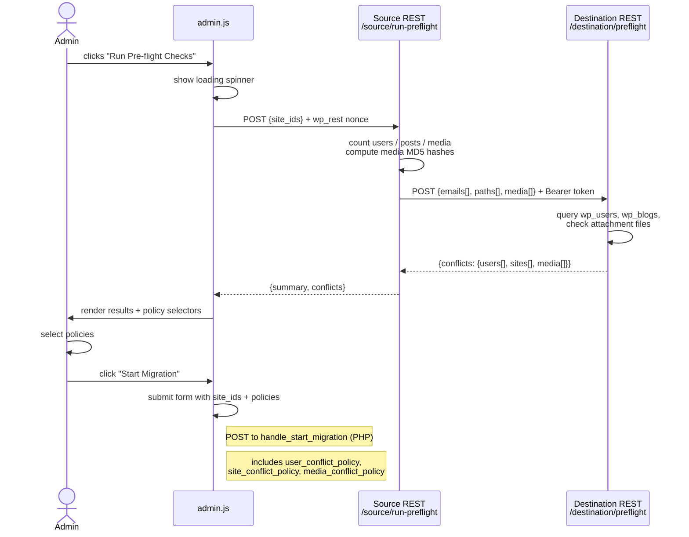
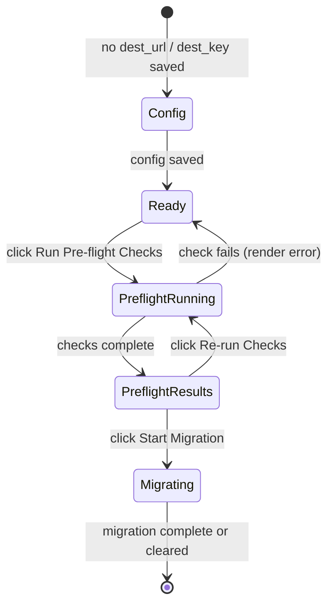

# feat: Pre-flight migration checks and conflict resolution

## Summary

The current migration UI has no preview step — users click "Start Migration" and discover conflicts (duplicate user emails, existing subsite paths, duplicate media files) only after the pipeline has already begun running. This plan adds a pre-flight check phase that runs before the user confirms. It shows summary stats (site count, user count, post count, media count + estimated disk usage) and surfaces detected conflicts grouped by type. For each conflict type, the user selects a resolution policy that the import pipeline then applies.

Conflict resolution is per-type (one policy covers all conflicts of that category), not per-item. User chose full hash-based media comparison for pre-flight detection.

---

## Problem Frame

**Current behavior**: Clicking "Start Migration" immediately fires the Action Scheduler pipeline. A user email collision silently maps the source author to the wrong destination user; a subsite path collision marks the site job as `failed` with a cryptic error; duplicate media files are always re-imported, wasting disk space. The user has no opportunity to review or configure before any of this happens.

**Desired behavior**: A "Run Pre-flight Checks" step runs before confirmation. It shows what will migrate and what will conflict. The user picks per-type resolution policies, then confirms. The pipeline applies those policies throughout.

---

## Requirements

| # | Requirement |
|---|-------------|
| R1 | Pre-flight shows a summary: site count, total user count, estimated post count, media count, estimated total file size |
| R2 | Detects user email conflicts: source user emails that already exist in `wp_users` on the destination |
| R3 | Detects site path conflicts: computed `dest_path` values that already exist in `wp_blogs` on the destination |
| R4 | Detects media file duplicates: source attachment files whose MD5 hash matches a file already on the destination |
| R5 | User selects a per-type resolution policy for each conflict type that has at least one conflict |
| R6 | User email policy: `merge` (map to existing user) or `create` (new account with modified email) |
| R7 | Site path policy: `use_existing` (import into the existing site at that path) or `generate_new` (append `-2`, `-3`, etc. until unique) |
| R8 | Media policy: `import_all` (always import, current behavior) or `skip_duplicates` (reuse existing attachment for duplicate files) |
| R9 | Conflict policies pass from the admin form through `destination/begin` and are stored on `hbm_migrations` |
| R10 | UserImporter, TermImporter, and MediaImporter apply the stored policies during migration |

---

## Key Technical Decisions

**Pre-flight architecture: source-gathers, destination-checks.** The source site reads its own data locally (user emails, site metadata, media file hashes), then sends this to the destination via a single HTTP call. The destination checks only its own DB and filesystem — it never calls back to the source during pre-flight. This keeps the roundtrip to one HTTP request and avoids the destination needing source credentials just for conflict detection.

**Admin interaction model: AJAX for pre-flight, form POST for confirmation.** Pre-flight can take several seconds (media hashing, outbound HTTP). An AJAX call with a loading state prevents PHP timeouts and provides responsive UX. The subsequent "Start Migration" confirmation uses the existing PHP form POST pattern, extended to include policy selections as hidden inputs. Results are held in JS state; no transient storage needed.

**Media hash check scope: filename filter + hash comparison.** For pre-flight, the source computes `hash_file('md5', $local_path)` per attachment and sends `{filename, filesize, md5}` to the destination. The destination first filters by filename (matching `post_name` in `wp_posts` for existing attachments), then verifies the hash against the file on disk. Only filename-matched files reach the hash check, keeping the pre-flight fast. A configurable filter cap (default: first 500 attachments per site) guards against timeout on very large media libraries.

**Modified email for "create" policy.** When the user email policy is `create`, UserImporter generates a modified email: `{user_login}+imported@{source_domain}` where `source_domain` is extracted from the migration's `source_url`. A uniqueness loop appends a counter if that also conflicts. The original email is stored in user meta (`hbm_original_email`) for traceability.

**Policy storage: new columns on `hbm_migrations`.** Three columns added: `user_conflict_policy`, `site_conflict_policy`, `media_conflict_policy`. All default to the existing implicit behavior (merge, generate_new, import_all) so in-flight migrations without these columns degrade gracefully when the DB schema upgrades. DB version bumps to 4.

**Site path conflict — "generate_new" as default.** The current code already fails hard on path collision; `generate_new` replaces that failure with a retry loop. `use_existing` maps the new site job to an already-existing subsite, which means content from the source subsite lands in a pre-existing destination subsite — appropriate for incremental re-migrations. This logic lives in `TermImporter::create_subsite()` where the collision is first detected.

---

## High-Level Technical Design

### Pre-flight request flow



### Admin page states



---

## Scope Boundaries

**In scope**: user email, site path, and media hash conflict detection; per-type policy selection; policy application in UserImporter, TermImporter, MediaImporter; summary stats in the pre-flight report.

**Deferred to Follow-Up Work**:
- Per-item conflict resolution (choose per individual user/site/file — per-type is this plan)
- Post slug or term conflicts
- Handling very large media libraries (>500 files) with batched or async hashing
- Conflict policy for the "stop migration" feature (separate plan in flight)

**Outside scope**: Automated scheduling based on pre-flight results; diff between two migrations; rollback to pre-migration state.

---

## Implementation Units

### U4. Schema: conflict policy columns on migrations

**Goal**: Add the three conflict policy columns to `hbm_migrations`, bump DB version to 4, and thread the new fields through `MigrationRegistry` and `MigrationReceiver`.

**Requirements**: R9

**Dependencies**: none

**Files**:
- `hb-migrator.php` — bump `HBM_DB_VERSION` constant to 4
- `includes/class-queue-table.php` — `dbDelta` adds the three columns; update `maybe_create_or_upgrade()`
- `includes/class-migration-registry.php` — `create_migration()` accepts optional `array $conflict_policies`; new `get_conflict_policies(int $migration_id): array` helper
- `includes/destination/class-migration-receiver.php` — `begin()` reads `user_conflict_policy`, `site_conflict_policy`, `media_conflict_policy` from request body, passes to `create_migration()`
- `tests/test-migration-receiver.php` — extend existing tests

**Approach**: `dbDelta` handles `ALTER TABLE` on upgrade when the column is absent. All three columns carry safe `DEFAULT` values (`'merge'`, `'generate_new'`, `'import_all'`) so existing rows get the current implicit behavior without a backfill. `MigrationReceiver::begin()` accepts the three policy params as optional request body fields with the same defaults.

**Patterns to follow**: `MigrationRegistry::create_migration()` column additions follow existing `$wpdb->insert()` pattern; `QueueTable::maybe_create_or_upgrade()` `dbDelta` call for new columns.

**Test scenarios**:
- `create_migration()` with no conflict policies → all three columns store the default values
- `create_migration()` with explicit `'create'` user policy → stored correctly
- `MigrationReceiver::begin()` POST body includes `user_conflict_policy=create` → migration record has `user_conflict_policy='create'`
- `MigrationReceiver::begin()` POST body omits all policies → defaults applied (no 400 error)
- DB upgrade from version 3 to 4 leaves existing migration rows with default policy values

**Verification**: `maybe_create_or_upgrade()` runs; migrating an existing install adds all three columns; new `create_migration()` calls with explicit policies store correctly; existing test suite still passes.

---

### U1. Destination pre-flight endpoint

**Goal**: Add `POST /destination/preflight` — a new authenticated endpoint that accepts the source's user emails, site dest_paths, and media fingerprints, then checks for conflicts against the destination's own DB and filesystem.

**Requirements**: R2, R3, R4

**Dependencies**: none

**Files**:
- `includes/destination/class-preflight-checker.php` — new class, `check(array $payload): array`
- `includes/destination/class-migration-receiver.php` — register new route in `register_routes()`
- `includes/source/class-source-endpoints.php` — no changes (destination route, not source)
- `tests/test-destination-preflight.php` — new test file

**Approach**: `PreflightChecker::check()` receives `{sites[], user_emails[], media[]}`. It runs three independent checks:

1. **User emails**: `SELECT user_email FROM wp_users WHERE user_email IN (…)` — returns matched emails.
2. **Site paths**: `get_sites(['domain' => get_network()->domain, 'path__in' => [paths…]])` — returns matched paths.
3. **Media**: For each `{blog_id, filename, md5, filesize}`, `switch_to_blog()` then query `wp_posts WHERE post_type='attachment' AND post_name = sanitize_title(filename)`. For any filename match, check the file at `get_attached_file()` — if readable, `hash_file('md5', $path)` and compare. Accumulate matches.

The endpoint handler validates the Bearer token via `ApiAuth::verify_request()` (same as `/destination/begin`). No new auth mechanism needed.

**Patterns to follow**: `MigrationReceiver::begin()` route registration; `ApiAuth::verify_request()` for `permission_callback`; `switch_to_blog()` / `restore_current_blog()` pattern from `TermImporter`.

**Test scenarios**:
- POST with zero conflicts across all three types → response `{conflicts: {users:[], sites:[], media:[]}}`
- POST with one email that matches a `wp_users` row → that email appears in `conflicts.users`
- POST with a dest_path that matches an existing `wp_blogs` row for the network → path appears in `conflicts.sites`
- POST with a media entry whose filename matches an existing attachment AND whose MD5 matches the file on disk → entry appears in `conflicts.media`
- POST with a media entry whose filename matches but MD5 differs → NOT in `conflicts.media`
- POST with no Bearer token → 401 (ApiAuth rejects)
- POST with malformed payload (no `user_emails` key) → safe empty results, no PHP error

**Verification**: All test scenarios pass; endpoint is listed in `register_routes()`; manual POST with known conflict data returns the expected shape.

---

### U2. Source pre-flight service and admin AJAX endpoint

**Goal**: Add the `PreflightService` class that gathers source-side data (user emails, site metadata, media hashes) and calls the destination, plus a source REST endpoint that the admin JS calls.

**Requirements**: R1, R2, R3, R4

**Dependencies**: U1 (destination endpoint must exist to call)

**Files**:
- `includes/source/class-preflight-service.php` — new class
- `includes/source/class-source-endpoints.php` — register `/source/run-preflight`
- `includes/class-plugin.php` — ensure `PreflightService` is autoloaded / included
- `tests/test-preflight-service.php` — new test file

**Approach**:

`PreflightService::gather(array $blog_ids): array` — runs on the source:
- Users: `get_users(['blog_id' => null, 'fields' => 'user_email'])` across all network users (one query).
- Posts: `wp_count_posts()` per blog for summary stats.
- Media: for each blog_id, `switch_to_blog()`, get attachments up to the cap (default 500, filterable via `apply_filters('hbm_preflight_media_limit', 500, $blog_id)`). For each, `get_attached_file()` and `hash_file('md5', $path)` if the file is locally readable. Attach `{blog_id, filename, filesize, md5}` to the media list.
- Sites: reads `hbm_dest_url` / `hbm_dest_key` from sitemeta plus computed `dest_path` for each blog.

`PreflightService::run(array $blog_ids): array` — calls `gather()` then POSTs to `/destination/preflight` via `wp_remote_post()` with a 60-second timeout. Returns a merged `{summary, conflicts}` array (summary from gathered stats, conflicts from destination response).

The `/source/run-preflight` REST endpoint has `permission_callback => fn() => current_user_can('manage_network')`. It accepts `site_ids` as a query/body param, calls `PreflightService::run()`, and returns the result as JSON. Errors from the destination call are returned as 502.

**Patterns to follow**: `SiteIndex::proxy_migration_status()` for calling the destination from a source REST endpoint; `switch_to_blog()` / `restore_current_blog()` guard pattern from `PostReader`.

**Test scenarios**:
- `gather()` with one blog returns correct user email list from `wp_users`
- `gather()` counts posts per blog accurately
- `gather()` skips media hashing when no attachments exist (no error)
- `gather()` respects the media limit filter — stops at N files
- `run()` when destination returns a non-200 → returns WP_Error / throws; endpoint returns 502
- `/source/run-preflight` without `manage_network` capability → 401
- `/source/run-preflight` with valid request calls `PreflightService::run()` and returns its output

**Verification**: Unit tests pass; manual call to `/source/run-preflight` against a live destination returns populated `summary` and empty or populated `conflicts` correctly.

---

### U3. Admin page pre-flight UI

**Goal**: Replace the direct "Start Migration" button with a two-step flow: "Run Pre-flight Checks" (AJAX, shows results + policy selectors), then "Start Migration" (form POST with policies included).

**Requirements**: R1, R2, R3, R4, R5, R6, R7, R8

**Dependencies**: U1, U2 (endpoints must exist), U4 (policy fields in start migration handler)

**Files**:
- `includes/admin/class-admin-page.php` — update `render_page()`, `enqueue_assets()`, `handle_start_migration()`
- `assets/js/admin.js` — add pre-flight trigger, result rendering, policy form management
- `assets/css/admin.css` — styling for conflict sections, policy radios, summary stat cards
- `tests/test-admin-page.php` — extend or add tests for PHP rendering changes

**Approach**:

PHP (`render_page()`):
- Replace `<button>Start Migration</button>` with `<button id="hbm-preflight-btn">Run Pre-flight Checks</button>`.
- Add `<div id="hbm-preflight-results" hidden>` placeholder for JS-rendered results.
- Add `<div id="hbm-preflight-start" hidden>` containing the final "Start Migration" form with hidden `user_conflict_policy`, `site_conflict_policy`, `media_conflict_policy` inputs. JS populates these before submit.
- `enqueue_assets()` adds `preflightEndpoint` to `hbmAdmin` localized data.

PHP (`handle_start_migration()`):
- Read `user_conflict_policy`, `site_conflict_policy`, `media_conflict_policy` from `$_POST`, sanitize with `sanitize_key()`, pass to the `destination/begin` HTTP call body.

JS (`admin.js`):
- Pre-flight button: reads `site_ids[]` checkboxes, POSTs to `hbmAdmin.preflightEndpoint` with nonce. Shows spinner.
- On success: renders summary stat row (site count, user count, post count, media count, disk size). Renders conflict sections only when `conflicts.*` arrays are non-empty. Each section has a heading with badge count and two labeled radio inputs for the policy.
- On no conflicts: shows a green "No conflicts found. Ready to migrate." banner and activates the Start button.
- "Start Migration" form: JS sets the three hidden policy inputs from the selected radios before submit.
- On pre-flight failure: shows error banner, re-enables the "Run Pre-flight Checks" button.

**Patterns to follow**: Existing polling `renderSite()` + `esc()` helpers in `admin.js` for DOM manipulation; `wp_nonce_field()` pattern in `render_page()` forms; `wp_localize_script()` pattern in `enqueue_assets()`.

**Test scenarios (PHP)**:
- When `$dest_url` and `$dest_key` are set, `render_page()` output contains `id="hbm-preflight-btn"` and NOT `hbm_start_migration` form submit button
- `enqueue_assets()` output includes `preflightEndpoint` key in `hbmAdmin`
- `handle_start_migration()` with `user_conflict_policy=create` in `$_POST` passes `'user_conflict_policy' => 'create'` in the `destination/begin` request body
- `handle_start_migration()` with no policy fields in `$_POST` does not error and uses safe defaults

**Test scenarios (JS — describe for manual verification)**:
- Clicking "Run Pre-flight Checks" disables the button and shows a loading indicator
- Summary stats appear after a successful pre-flight response
- Conflict section for user emails renders only when `conflicts.users` is non-empty
- Each conflict section shows the correct conflict count in its heading badge
- Selecting a policy radio and clicking "Start Migration" submits the form with the correct policy value in the request

**Verification**: PHP tests pass; manual test of the full flow: configure destination, select sites, run pre-flight, see results, select policies, confirm migration starts. Confirm `hbm_migrations` record has correct policy values after start.

---

### U5. UserImporter: apply user conflict policy

**Goal**: When `$migration->user_conflict_policy === 'create'`, bypass the email-match and always create a new destination user, using a generated unique email.

**Requirements**: R6, R10

**Dependencies**: U4

**Files**:
- `includes/destination/class-user-importer.php`
- `tests/test-user-importer.php` — new or extended test file

**Approach**: In `process()`, after `$migration = MigrationRegistry::get_migration(...)`, read `$policy = $migration->user_conflict_policy ?? 'merge'`. Gate the existing `get_user_by('email', …)` block on `$policy === 'merge'`. When `$policy === 'create'`, skip the email lookup and proceed directly to `wp_insert_user()`. If `wp_insert_user()` fails with a duplicate-email error, call a new private helper `make_unique_email(string $email, string $login, string $source_url): string` that tries `{login}+imported@{source_domain}`, then `{login}+imported2@…`, etc., then retries. On success, store the original email in `update_user_meta($dest_user_id, 'hbm_original_email', $u['user_email'])`.

**Patterns to follow**: Existing `unique_login()` helper for the uniqueness loop pattern.

**Test scenarios**:
- Policy=`merge`, source email matches existing user → `$dest_user_id` equals existing user's ID; no new user created
- Policy=`merge`, source email has no match → new user created with original email
- Policy=`create`, source email matches existing user → new user created; new user's email is NOT the original email; `hbm_original_email` meta equals original email
- Policy=`create`, generated modified email also conflicts → function retries and finds a unique address; new user is created successfully
- Policy=`create`, source email has no match → new user created normally (no modification needed, original email used)

**Verification**: Tests pass; migrate a source user whose email already exists on destination with policy=`create`; confirm destination has two separate users, the new one has `hbm_original_email` meta; IdMap maps source user ID to the new user.

---

### U6. TermImporter: apply site conflict policy

**Goal**: Replace the hard-failure on path collision with policy-driven behavior: `generate_new` appends a numeric suffix until unique; `use_existing` finds and reuses the existing subsite.

**Requirements**: R7, R10

**Dependencies**: U4

**Files**:
- `includes/destination/class-term-importer.php`
- `tests/test-term-importer.php` — new or extended test file

**Approach**: In `create_subsite()`, read the migration's `site_conflict_policy` (needs `$job->migration_id` → `get_migration()` or pass policy as a parameter from `process()`). Replace the current `blog_slug_already_exists` failure branch:

- `generate_new` (default): retry `wp_insert_site()` with path suffixes `/name-2/`, `/name-3/`, up to a limit (10 attempts). If still colliding after 10, mark the job failed with a clear error.
- `use_existing`: call `get_sites(['domain' => $network->domain, 'path' => $job->dest_path, 'network_id' => …])`. If a site is found, return its `blog_id` and skip creation. If not found, fall back to `generate_new` behavior (the conflict detection should have caught this, but guard defensively).

**Patterns to follow**: `wp_insert_site()` call and error handling in `create_subsite()`; `get_sites()` usage from `MultisiteHandler`.

**Test scenarios**:
- Policy=`generate_new`, no collision → subsite created at original dest_path
- Policy=`generate_new`, dest_path `/name/` exists → subsite created at `/name-2/`; site job `dest_path` updated to `/name-2/`
- Policy=`generate_new`, `/name/` and `/name-2/` both exist → subsite created at `/name-3/`
- Policy=`use_existing`, dest_path `/name/` exists → `create_subsite()` returns the existing site's `blog_id`; no new site created
- Policy=`use_existing`, dest_path not found after all → falls back to `generate_new` behavior

**Verification**: Tests pass (requires multisite test environment); manually verify that a migrated site with a conflicting path creates `/name-2/` with `generate_new` policy.

---

### U7. MediaImporter: apply media conflict policy

**Goal**: When `media_conflict_policy === 'skip_duplicates'`, check whether a destination attachment with the same filename (post_name) already exists before downloading. If found, record the IdMap entry pointing to the existing attachment and skip the download.

**Requirements**: R8, R10

**Dependencies**: U4

**Files**:
- `includes/destination/class-media-importer.php`
- `tests/test-media-importer.php` — new or extended test file

**Approach**: In `process()`, after loading `$migration`, read `$policy = $migration->media_conflict_policy ?? 'import_all'`. For each media item, when `$policy === 'skip_duplicates'`, add a check before the download:

```
switch_to_blog($dest_blog_id);
$existing = get_posts([
    'post_type'  => 'attachment',
    'name'       => sanitize_title($item['post_name']),
    'post_status' => 'any',
    'numberposts' => 1,
]);
restore_current_blog();
```

If `$existing` is non-empty, write the IdMap entry (`IdMap::set($site_job_id, 'media', $source_id, $existing[0]->ID)`) and `continue` — no download, no new attachment post. If empty, proceed with the existing download + `wp_insert_attachment()` path.

Note: this is a filename check, not a hash check. The hash comparison is for pre-flight detection only. During migration execution, filename match is sufficient and avoids the cost of downloading just to hash-compare.

**Patterns to follow**: `IdMap::set()` calls and `switch_to_blog()` guard in existing `MediaImporter::process()`.

**Test scenarios**:
- Policy=`import_all`, destination has attachment with same filename → attachment is still imported (new duplicate created)
- Policy=`skip_duplicates`, destination has no attachment with matching filename → attachment downloaded and imported normally
- Policy=`skip_duplicates`, destination has attachment with matching `post_name` → download skipped; IdMap maps source attachment ID to existing destination attachment ID
- Policy=`skip_duplicates`, multiple media items, some with matches and some without → only unmatched items are downloaded; matched items get IdMap entries pointing to existing attachments
- Policy=`skip_duplicates`, matching attachment exists in a different blog's uploads → not matched (must be in the correct destination blog)

**Verification**: Tests pass; manual migration run with `skip_duplicates` policy and pre-seeded destination attachments confirms no duplicate files are created and IdMap correctly maps source IDs.

---

## Open Questions

- **Timeout for large media libraries**: `PreflightService::gather()` with 500 attachments per site can take 10–30 seconds depending on file sizes and server I/O. The 60-second timeout on the source REST endpoint may be tight on some hosts. A future improvement: run media hashing as a separate AS job and poll for results, rather than blocking the AJAX request. Deferred to follow-up.
- **Destination-side media check for non-local files**: `hash_file()` on the destination only works when the attachment file is local (not on an object store like S3). If the destination uses external object storage, the file check step needs to be skipped or adapted. Deferred to follow-up.

---

## Risks & Dependencies

| Risk | Likelihood | Mitigation |
|------|-----------|------------|
| Pre-flight times out on large media libraries | Medium | `hbm_preflight_media_limit` filter caps at 500; document the limit in the UI |
| Pre-flight results go stale between check and confirm | Low | UI shows timestamp; re-running is one click |
| `use_existing` policy imports content into a wrong destination subsite | Low | Document clearly; default is `generate_new` |
| PHP max_execution_time on source AJAX endpoint | Medium | 60s wp_remote_post timeout; note in UI that large sites may be slow |

---

## Sources & Research

External research was not needed — the approach maps directly to existing patterns in the codebase. Key references:
- `includes/destination/class-migration-receiver.php` — existing destination endpoint pattern for auth and request structure
- `includes/source/class-site-index.php` — `proxy_migration_status()` for outbound call from source REST endpoint
- `includes/destination/class-user-importer.php` — email conflict is the specific driver for this feature; `unique_login()` for uniqueness loop pattern
- `includes/destination/class-term-importer.php` — `create_subsite()` and `blog_slug_already_exists` error handling
- `assets/js/admin.js` — existing AJAX, polling, and DOM patterns to mirror
