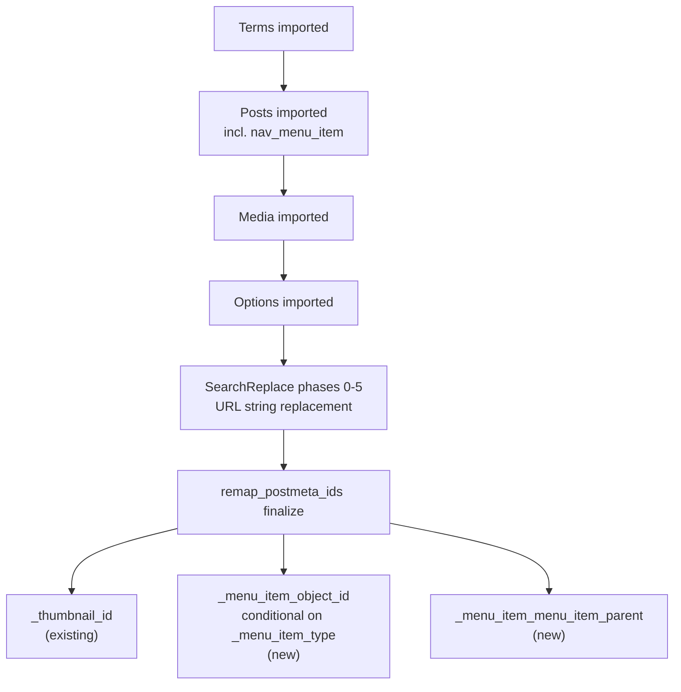

# fix: Exclude non-portable post types and remap nav menu item references

## Summary

The source `posts` endpoint (`includes/source/class-post-reader.php`) excludes only `post_type = 'attachment'`; every other WordPress core post type — including internal, site-scoped, or privacy-sensitive types like `revision`, `user_request`, and `customize_changeset` — passes through unfiltered and gets inserted at the destination. This plan extends the same exclude/remap discipline already applied to attachments (`(see origin: docs/plans/2026-06-26-001-fix-attachment-doubling-email-site-slug-plan.md)`, Deferred to Follow-Up Work) to the rest of WordPress's built-in post types, extends the existing `_thumbnail_id`-style ID remap to cover `nav_menu_item` object references, and adds a cleanup command remediating `user_request` posts already copied by migrations that ran before this fix.

## Problem Frame

`class-post-reader.php:17` filters only `attachment` out of the source SQL query. WordPress registers several other built-in post types that are either internal bookkeeping (never meant to leave a single site) or reference IDs that are meaningless without remapping:

- `revision`, `customize_changeset`, `oembed_cache`, `custom_css` — internal/transient records tied to a specific site's editing history or theme; importing them clutters the destination with inert rows.
- `user_request` — GDPR data-export/erase request records scoped to the source site's own users, carrying a `post_password` confirmation key. Importing these is a privacy and security exposure, not just clutter.
- `wp_font_family` / `wp_font_face` — Font Library entries whose actual font files are not fetched by the media pipeline, producing the same "hollow record" problem the original attachment-post exclusion was built to prevent.
- `nav_menu_item` — legitimate content, but its `_menu_item_object_id` and `_menu_item_menu_item_parent` postmeta reference source-site IDs. `SearchReplace::remap_postmeta_ids()` (`includes/destination/class-search-replace.php:297`) only remaps `_thumbnail_id` today, so menu items currently land pointing at whatever destination content happens to share the same numeric ID — silently wrong, not merely absent.

## Requirements

**Post type exclusion**

- R1. The source `posts` endpoint excludes `revision`, `customize_changeset`, `oembed_cache`, `custom_css`, `user_request`, `wp_font_family`, and `wp_font_face` in addition to `attachment`.
- R2. The destination post importer independently skips the same excluded post types, so an older source plugin version cannot push them through.
- R3. The exclusion list is defined once and referenced by both source and destination code, so the two sides cannot drift out of sync.

**Nav menu item remap**

- R4. `nav_menu_item` posts continue to import through the normal posts pipeline (not excluded).
- R5. After a site job's posts and terms are fully imported, `_menu_item_object_id` is rewritten to the destination ID: via the post or attachment `IdMap` when the sibling `_menu_item_type` meta is `post_type`, via the term `IdMap` when it is `taxonomy`, and left unchanged for `custom` and `post_type_archive` types.
- R6. `_menu_item_menu_item_parent` is rewritten to the destination `nav_menu_item` post ID via the post `IdMap`.

**Remediation**

- R7. A cleanup command exists to remove `user_request` posts already copied to destination sites by migrations completed before this fix ships.

## Key Technical Decisions

- **Hardcoded exclusion list, not a DB-driven policy.** Mirrors the existing `attachment` skip and `SearchReplace::SKIP_OPTION_NAMES` pattern — these are structurally non-portable WordPress-internal types, not a user-configurable migration option. No admin UI or migration-table column is needed.
- **Shared policy class over duplicated constants.** A new root-namespace class (`includes/class-post-type-policy.php`, mirroring the `includes/class-*.php` convention used by `IdMap`, `MigrationRegistry`, etc.) holds the single exclusion list, `use`d from both `Source\PostReader` and `Destination\PostImporter`. Prevents the two call sites drifting the way a duplicated literal would.
- **`nav_menu_item` is remapped, not excluded.** Unlike the other internal types, menu items are meaningful destination content once their object references are correct. The existing `IdMap` already tracks both `'post'` and `'term'` object types with everything needed for the remap by the time `SearchReplace::finalize()` runs — no new tracking is needed, only two additional `UPDATE ... JOIN` passes alongside the existing `_thumbnail_id` remap.
- **`_menu_item_object_id` remap is conditional on `_menu_item_type`.** The same numeric ID space is shared by posts, pages, and terms, so a blind join (as used for `_thumbnail_id`, which is always an attachment) would misroute taxonomy-linked menu items. The remap joins postmeta to itself on `post_id` to read the sibling `_menu_item_type` value first.
- **`wp_block`, `wp_template`, `wp_template_part`, `wp_global_styles`, `wp_navigation` are left unchanged.** These are legitimate, user-authored content (reusable blocks, FSE templates, block-based navigation) with no evidence of causing active bugs. `wp_navigation` post content can itself embed post/page IDs inside block markup — that gap is not solved by this plan (see Scope Boundaries) but is no worse than today's status quo, where block-content ID references are already outside `SearchReplace`'s remap scope.

## High-Level Technical Design



All three remap passes run inside the existing `remap_postmeta_ids()` finalize step, after posts and terms for the site job are guaranteed complete — the pipeline order (terms → posts → media → options → search-replace) is unchanged.

## Implementation Units

### U1. Shared post-type exclusion policy

**Goal:** Define the excluded-post-type list once, in a location both source and destination code can reference.

**Requirements:** R1, R2, R3

**Dependencies:** None

**Files:**
- `includes/class-post-type-policy.php` (new)
- `tests/test-post-type-policy.php` (new, add tests)

**Approach:** New class `HBMigrator\PostTypePolicy` at root namespace, following the `IdMap`/`MigrationRegistry` file-naming convention (`includes/class-post-type-policy.php`, autoloaded per the PSR-4-style mapping in `hb-migrator.php`). Expose a single method, e.g. `PostTypePolicy::excluded_post_types(): array`, returning `[ 'attachment', 'revision', 'customize_changeset', 'oembed_cache', 'custom_css', 'user_request', 'wp_font_family', 'wp_font_face' ]`. `attachment` moves into this shared list so both call sites read from one source of truth instead of `class-post-importer.php` keeping its own hardcoded check.

**Patterns to follow:** `SearchReplace::SKIP_OPTION_NAMES` (`includes/destination/class-search-replace.php:13`) for the shape of a small, named exclusion constant with a comment explaining why both sides must agree.

**Test scenarios:**
- `excluded_post_types()` returns an array containing all eight expected type slugs.
- `excluded_post_types()` return value contains no duplicates.

**Verification:** Unit test asserts the exact expected set.

---

### U2. Source-side post type exclusion

**Goal:** Extend the source `posts` endpoint SQL filter from the single `attachment` exclusion to the full shared list.

**Requirements:** R1

**Dependencies:** U1

**Files:**
- `includes/source/class-post-reader.php` (modify)
- `tests/test-post-reader.php` (new, add tests)

**Approach:** Replace the literal `post_type != 'attachment'` clause (`includes/source/class-post-reader.php:17`) with a `post_type NOT IN (...)` clause built from `PostTypePolicy::excluded_post_types()`, using `$wpdb->prepare()` with a dynamically-sized placeholder string (same pattern already used for the `post_id IN (...)` placeholder construction at line 41).

**Patterns to follow:** `tests/test-media-reader.php` for source-side REST endpoint test scaffolding (`WP_REST_Request` construction, calling the static handler directly, asserting on `WP_REST_Response::get_data()`) — there is currently no `tests/test-post-reader.php`, so this unit also establishes that file.

**Test scenarios:**
- Default query: posts of type `post` and `page` are returned.
- Each excluded type (`revision`, `customize_changeset`, `oembed_cache`, `custom_css`, `user_request`, `wp_font_family`, `wp_font_face`, `attachment`) is individually excluded from the response when present in the DB.
- Mixed batch: a request spanning both included and excluded types in the same `ID` range returns only the included ones, preserving `last_id` pagination correctness.
- `nav_menu_item` posts are still returned (confirms it is not accidentally added to the exclusion list).

**Verification:** New test file passes; existing `attachment`-exclusion behavior is unchanged (covered by the "each excluded type" case).

---

### U3. Destination-side defense-in-depth guard

**Goal:** Make the destination post importer skip the same excluded types independently of the source filter.

**Requirements:** R2, R3

**Dependencies:** U1

**Files:**
- `includes/destination/class-post-importer.php` (modify)
- `tests/test-post-importer.php` (modify, extend `test_attachment_post_type_is_skipped` coverage)

**Approach:** Replace the `if ( 'attachment' === ( $p['post_type'] ?? '' ) )` guard (`includes/destination/class-post-importer.php:46`) with `if ( in_array( $p['post_type'] ?? '', \HBMigrator\PostTypePolicy::excluded_post_types(), true ) )`.

**Patterns to follow:** Existing `test_attachment_post_type_is_skipped` and `test_attachment_skipped_and_regular_post_imported_in_mixed_batch` (`tests/test-post-importer.php:127`, `:147`) — extend the same shape to the other excluded types rather than writing a parallel test structure.

**Test scenarios:**
- For each excluded type, a mocked source response containing that post type produces no destination post row (mirrors `test_attachment_post_type_is_skipped`).
- Mixed batch: an excluded-type post and a regular `post` in the same response — only the regular post is created (mirrors `test_attachment_skipped_and_regular_post_imported_in_mixed_batch`).
- Excluded-type source IDs are not written to `IdMap` (mirrors `test_attachment_source_id_not_in_idmap`).
- `nav_menu_item` posts in a mocked response are still imported (defense-in-depth guard does not regress R4).

**Verification:** Extended `tests/test-post-importer.php` suite passes.

---

### U4. Nav menu item postmeta ID remap

**Goal:** Extend `remap_postmeta_ids()` to rewrite `_menu_item_object_id` and `_menu_item_menu_item_parent` alongside the existing `_thumbnail_id` remap.

**Requirements:** R4, R5, R6

**Dependencies:** U2, U3 (nav_menu_item must be flowing through the pipeline unmodified for the remap to have rows to act on)

**Files:**
- `includes/destination/class-search-replace.php` (modify)
- `tests/test-search-replace.php` (modify, extend `remap_postmeta_ids` coverage)

**Approach:** Add new remap passes inside `remap_postmeta_ids()` (`includes/destination/class-search-replace.php:297`), run alongside the existing `_thumbnail_id` update:

```
-- _menu_item_object_id, when the sibling _menu_item_type = 'post_type':
-- try the post IdMap first, then fall back to the attachment IdMap. A
-- post_type-linked menu item can point at an attachment (added via the
-- Media Library "Add to Menu" flow), which IdMap tracks under a separate
-- object_type from ordinary posts.
UPDATE postmeta AS pm
JOIN postmeta AS pm_type
  ON pm_type.post_id = pm.post_id AND pm_type.meta_key = '_menu_item_type'
JOIN hbm_id_map AS im
  ON CAST(pm.meta_value AS UNSIGNED) = im.source_id
 AND im.site_job_id = :site_job_id
 AND im.object_type IN ('post', 'attachment')
SET pm.meta_value = im.dest_id
WHERE pm.meta_key = '_menu_item_object_id' AND pm_type.meta_value = 'post_type'

-- same shape again with pm_type.meta_value = 'taxonomy' and im.object_type = 'term'

-- _menu_item_menu_item_parent, unconditional (always a post/nav_menu_item ID)
UPDATE postmeta AS pm
JOIN hbm_id_map AS im
  ON CAST(pm.meta_value AS UNSIGNED) = im.source_id
 AND im.site_job_id = :site_job_id AND im.object_type = 'post'
SET pm.meta_value = im.dest_id
WHERE pm.meta_key = '_menu_item_menu_item_parent' AND pm.meta_value != '0'
```

This is directional — final implementation follows the existing `$wpdb->prepare()` / `// phpcs:ignore WordPress.DB.DirectDatabaseQuery` style already used in `remap_postmeta_ids()`, not literal copy-paste SQL. The `hbm_id_map` table's `UNIQUE KEY lookup (site_job_id, object_type, source_id)` (`includes/class-queue-table.php:74`) backs both joins.

`remap_postmeta_ids()` currently runs as a single unbounded pass with no time-budget checkpoint, unlike every other phase in this file (`replace_in_column()` and `replace_in_options()` both chunk via `TIME_LIMIT` and a keyset cursor, `includes/destination/class-search-replace.php:171-203`). Adding two more full-table joins — one a self-join on `postmeta` — widens that gap. Bring the new passes in line with the file's existing discipline: chunk each remap pass with the same `TIME_LIMIT`/keyset-cursor pattern used in `replace_in_column()`, checkpointing and re-enqueueing `hbm_search_replace` on budget exhaustion rather than assuming the table is always small enough to finish in one call.

**Patterns to follow:** The existing `_thumbnail_id` `UPDATE ... JOIN` in the same method for statement shape and `switch_to_blog()` bracketing; `replace_in_column()`'s `TIME_LIMIT`/keyset-checkpoint pattern for chunking; `tests/test-search-replace.php:153-158`'s `ReflectionClass` pattern for invoking the private `remap_postmeta_ids()` method directly in tests.

**Test scenarios:**
- `post_type`-linked menu item: `_menu_item_object_id` pointing at a source post ID present in `IdMap` (`object_type = 'post'`) is rewritten to the destination post ID.
- `post_type`-linked menu item pointing at an attachment: `_menu_item_object_id` pointing at a source attachment ID present in `IdMap` (`object_type = 'attachment'`) is rewritten to the destination attachment ID, not left unchanged.
- `taxonomy`-linked menu item: `_menu_item_object_id` pointing at a source term ID present in `IdMap` (`object_type = 'term'`) is rewritten to the destination term ID.
- `custom`-type menu item: `_menu_item_object_id` (typically `0` or unmapped) is left unchanged.
- Nested menu item: `_menu_item_menu_item_parent` pointing at another migrated `nav_menu_item`'s source post ID is rewritten to that item's destination post ID.
- Top-level menu item: `_menu_item_menu_item_parent` of `0` is left unchanged (not treated as a mappable ID).
- Unmapped reference: `_menu_item_object_id` pointing at a source ID with no corresponding `IdMap` row in any checked `object_type` (e.g., the referenced post failed to import) is left unchanged rather than nulled or zeroed.
- Budget exhaustion: a remap pass that exceeds `TIME_LIMIT` mid-table checkpoints and resumes from the correct cursor on the next `hbm_search_replace` action, mirroring `replace_in_column()`'s existing checkpoint test coverage.

**Verification:** Extended `tests/test-search-replace.php` suite passes; existing `_thumbnail_id` remap tests remain green (no regression from the added joins).

---

### U5. GDPR cleanup command for already-migrated sites

**Goal:** Give operators a concrete, auditable way to remove `user_request` posts that already copied to destination sites from migrations completed before U1–U3 ship, rather than leaving that as an unowned rollout note.

**Requirements:** R7

**Dependencies:** U1 (reuses `PostTypePolicy::excluded_post_types()` to identify the target type)

**Files:**
- `includes/class-migration-registry.php` (modify — add a lookup for completed site jobs with a `dest_blog_id`, if `list_migrations()`/`get_site_jobs_for_migration()` don't already expose one)
- `includes/class-user-request-cleanup.php` (new — cleanup routine)
- A WP-CLI command registration point (follow whatever convention the plugin uses for admin-triggered one-off actions; there is no existing WP-CLI command in this plugin, so this introduces the first one)
- `tests/test-user-request-cleanup.php` (new, add tests)

**Approach:** A command that, for each completed site job with a non-null `dest_blog_id`, switches to that blog and deletes `post_type = 'user_request'` rows (and their postmeta) — the same type `U1`'s `PostTypePolicy::excluded_post_types()` now excludes going forward. Supports a `--dry-run` flag that reports counts per site without deleting, and logs what was deleted per site job so the cleanup is auditable rather than silent. Scoped to `user_request` only — the other newly-excluded types (`revision`, `customize_changeset`, etc.) are inert clutter per Scope Boundaries and don't need this remediation.

**Patterns to follow:** `MigrationRegistry::list_migrations()` / `get_site_jobs_for_migration()` for enumerating affected site jobs; `switch_to_blog()` / `restore_current_blog()` bracketing used throughout the destination importers.

**Test scenarios:**
- A completed site job with `user_request` posts on its destination blog: the command deletes those posts and their postmeta.
- `--dry-run`: reports the count of `user_request` posts that would be deleted per site job without deleting them.
- A site job with no `user_request` posts on its destination blog: no-op, reported as zero affected.
- A site job that is not `complete` (still `running`, `pending`, or `failed`) is skipped — cleanup only targets finished migrations.
- Re-running the command after a successful cleanup is idempotent — zero additional deletions.

**Verification:** Running the command in `--dry-run` mode against a migration with known `user_request` posts reports the correct count; running it for real leaves zero `user_request` posts on that destination blog.

---

## Scope Boundaries

**In scope:** source-endpoint post type exclusion, destination-side defense-in-depth exclusion, `nav_menu_item` object-reference remap.

**Out of scope:**
- `wp_block`, `wp_template`, `wp_template_part`, `wp_global_styles`, `wp_navigation` — kept as-is; no evidence of active bugs.
- Font files for `wp_font_face` — excluded from the pipeline entirely by this plan rather than given media-pipeline support.
- Non-core post types (e.g. WooCommerce `product`, `shop_order`) — no evidence this plugin is used against WooCommerce sites.
- Third-party-plugin post types that store PII (form submissions, helpdesk tickets, membership applications, etc.). `PostTypePolicy`'s exclusion list is a denylist of known WordPress-core types; it closes the core-privacy gap this plan identified but does not protect against PII-bearing post types introduced by plugins this migrator hasn't been run against. An allowlist-style policy would close that gap generally but is a larger redesign than this plan's scope.

### Deferred to Follow-Up Work

- Remapping post/page IDs referenced inside `wp_navigation` block markup (e.g. `core/navigation-link` block attributes) — a broader gap than `_menu_item_object_id`, since it requires parsing block content rather than a flat postmeta join.
- Deciding whether `wp_global_styles` should be excluded when the destination site uses a different active theme than the source (currently kept, since a mismatched theme slug in its postmeta makes the record inert rather than actively harmful).

## System-Wide Impact

- **Deploy-boundary jobs past posts-import are unaffected.** `remap_postmeta_ids()` reads current table state at finalize time rather than anything cached from the posts stage, so a job paused between posts-import and finalize when this ships still gets the corrected `nav_menu_item` remap automatically.
- **Deploy-boundary jobs mid-posts-import can end up in a mixed state.** `PostImporter::process()` resumes by `last_id`, so a job straddling the deploy can have earlier (pre-deploy) batches import an excluded type and later (post-deploy) batches correctly skip it — one site job left with a partial mix of excluded-type content. For `user_request`, U5's cleanup command covers this case (see Risks & Dependencies). The other excluded types are inert clutter with no remediation tooling — acceptable per Scope Boundaries, called out here rather than left implicit.
- **`hbm_id_map`'s `object_type = 'post'` rows gain a new reader, not a new writer.** `OptionImporter` already reads these rows for `page_on_front`-style option remaps; the new `nav_menu_item` remap reads the same rows `PostImporter` was already writing (nav menu items were never excluded from `IdMap::set()`). No conflict, but any future change to what gets written under `object_type = 'post'` must account for both consumers.
- **`remap_postmeta_ids()` retries are normally safe, now on a wider surface.** A failure mid-remap triggers a full retry of `finalize()`, and each `UPDATE ... JOIN` pass is self-limiting (it only matches rows that still hold a `source_id`, so a completed pass is a no-op on retry) — the same safety property the existing `_thumbnail_id` remap already relies on. The new `_menu_item_menu_item_parent` pass is self-referential (post ID → post ID), which is a theoretical chain-remap hazard if a `dest_id` collides with another row's still-unmapped `source_id`. No code change needed for this plan, but worth a one-line comment at the call site for future maintainers.

## Risks & Dependencies

- The `pm_type` self-join in U4 doubles the row scan cost of the `_thumbnail_id`-style single join, but runs once per site job at finalize time on data already scoped to one destination blog — not expected to be a meaningful cost at this plugin's operating scale.
- **Privacy/security risk (already-migrated sites).** Site jobs completed before this ships already copied `user_request` posts to the destination — WordPress's built-in GDPR export/erasure request records, where `post_password` is a live confirmation key and `post_title` is the requester's email. These are visible on the destination site's `Tools → Export/Erase Personal Data` screen, exposing a stranger's PII to destination admins; triggering "Erase Personal Data" there runs core erasers against the destination DB for that email. U5 provides the remediation for this — rollout is not complete until U5 has been run against every destination site migrated before this ships, in `--dry-run` first to confirm scope.
- **The same exposure recurs at the deploy boundary, not only for historical jobs.** A site job mid-posts-import when this ships can have earlier (pre-deploy) batches import `user_request` posts and later (post-deploy) batches correctly skip them — U5's cleanup command is reusable for this case too, since it operates per site job rather than as a one-time historical sweep. The same applies to any future change to `PostTypePolicy::excluded_post_types()` while jobs are mid-flight.
- **Data-integrity risk (already-migrated sites), distinct from the above.** `revision`, `customize_changeset`, `oembed_cache`, `custom_css`, `wp_font_family`, and `wp_font_face` rows already imported are inert clutter with no PII or security dimension — safe to leave per Scope Boundaries. `nav_menu_item` references on those older jobs remain un-remapped; a future pass could re-run the extended `remap_postmeta_ids()` against existing `hbm_id_map` rows without a full re-migration.
