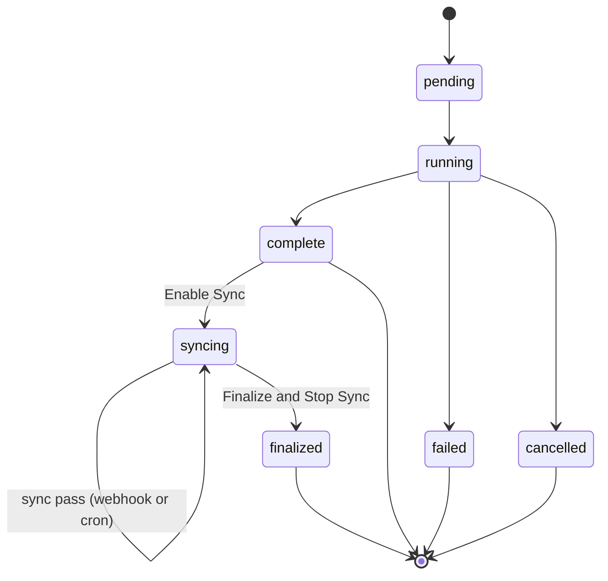
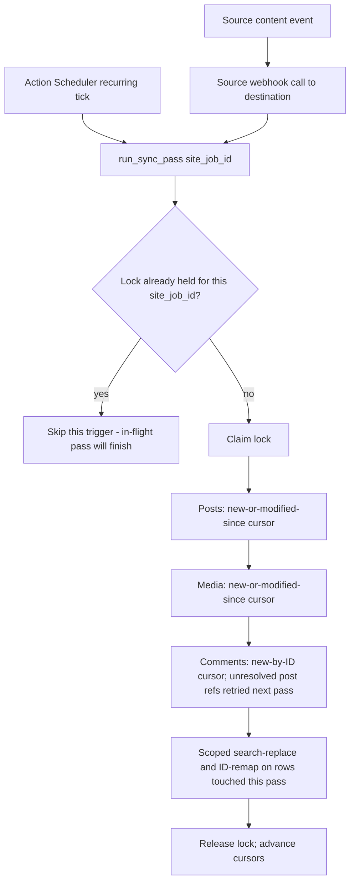

# feat: Ongoing post-migration content sync

## Summary

Extends HB Migrator with an ongoing sync capability so a `complete` site job can keep pulling new and edited posts and media, plus new comments (with comment edits handled webhook-only, see Key Technical Decisions), from source without a second full migration. Sync reuses the existing Reader/Importer/`IdMap` pipeline — the same classes that run the initial migration, invoked again with a delta cursor — rather than a parallel content-moving mechanism, per the origin brainstorm's core validated shape (see origin).

## Problem Frame

Once a site job reaches `complete`, HB Migrator has no way to pick up source-side changes made during the customer's QA window short of re-running the whole migration. The origin brainstorm validated that most of the existing pipeline stretches cleanly to repeated invocation, with three exceptions that need real design rather than "just run it again": options (wholesale-overwrite semantics would clobber destination-side QA changes), search-replace/ID-remap (currently a full-table rescan per invocation), and the site-job status lifecycle (terminal at `complete`, with failure handling that marks the whole job `failed`). Comments are not migrated by this plugin at all today, so covering them in sync means building comment migration from scratch (see origin).

## Key Technical Decisions

- **Sync is a state, not a new table.** `hbm_site_jobs.status` gains a new value, `syncing`, reached only from `complete` via an explicit "Enable Sync" admin action, and a new terminal value, `finalized`, reached via "Finalize & Stop Sync." No new table — the site job is already the single source of truth for a site's migration state, and adding sync cursor/lock columns to it keeps that true rather than splitting state across a join.
- **`MigrationRegistry::complete_migration()`'s credential wipe and `IdMap` cleanup move from "on complete" to "on finalize."** `complete_migration()` currently, in the same atomic step that marks a migration `complete`, blanks `hbm_migrations.source_api_key` to an empty string and deletes every `IdMap` row for each of its site jobs (`includes/class-migration-registry.php:106-132`) — a deliberate cleanup once a migration was assumed permanently done. This plan makes `complete` a mid-lifecycle state for any site job that later enables sync, and both of those cleanup actions would otherwise fire at the exact moment "Enable Sync" becomes available: an empty `source_api_key` means every sync-pass `SourceClient` call is rejected outright, and a deleted `IdMap` means every edit-sync "existing row" check fails and re-inserts a duplicate instead of updating (directly contradicting the "idempotent re-apply" premise this whole plan rests on). U1 changes `complete_migration()` to skip that cleanup when a migration has any site job capable of entering sync, and moves the same cleanup to run on "Finalize & Stop Sync" instead — the credential and mapping data now live exactly as long as they're needed, not conflated with mere pipeline completion. This is a real, if modest, security-posture change (the source credential and ID map persist longer than before for any migration that could sync); documented as a deliberate trade-off, not an oversight.
- **A single dispatcher, not per-trigger logic.** Both the cron poll and the webhook call the same `run_sync_pass( site_job_id )` entry point. The dispatcher claims a per-site-job lock, runs posts → media → comments → scoped search-replace in that order, then releases the lock and advances cursors. This is what prevents webhook and cron from racing each other and is the reuse point that keeps the two triggers from diverging into two different sync implementations.
- **The lock claim is a single atomic `UPDATE ... WHERE ... AND sync_locked_at IS NULL`, not a separate SELECT-then-UPDATE.** A SELECT-then-UPDATE claim has a real TOCTOU race between a webhook request (PHP-FPM worker) and a cron tick (separate Action Scheduler worker) — both can see the lock unclaimed before either writes it. `MigrationRegistry::complete_migration()` already replaced an equivalent two-step pattern with a single atomic `UPDATE` checked via `$wpdb->rows_affected` after hitting a replica-lag race in production; U2 reuses that exact pattern rather than the weaker `set_transient`-based soft mutex in `MigrationReceiver::begin()` (which its own comment already flags as "not perfectly atomic"). The claim UPDATE also treats a lock older than a set staleness threshold as unclaimed, so a pass whose owning process was killed mid-run (PHP timeout, OOM) doesn't lock a site job out of sync permanently — no existing lock/status mechanism in this codebase has a staleness concept to fall back on otherwise.
- **Posts and media use a timestamp-plus-ID delta cursor with a safety overlap that scales with the poll interval.** `PostReader`'s existing `ID > last_id` cursor only catches new rows; catching edits needs `post_modified`. The stored cursor is the latest `post_modified` seen, and each pass re-queries a window before that cursor in addition to everything after it. The real risk this guards against is source-side transaction-commit visibility lag — a row can commit with an earlier `post_modified` than a query that already ran past that timestamp — which is deployment-dependent and not bounded by a universal constant, so the overlap is `max( 60 seconds, U7's cron interval )` rather than a fixed value: it self-scales so a faster or slower poll cadence doesn't silently widen or shrink the correctness margin. This is safe because re-applying an unchanged post is a no-op — the existing `IdMap`-keyed re-apply path is idempotent.
- **`PostImporter`'s existing-row branch is extended to update core fields, not only postmeta.** Today, when `IdMap` already has a row for a source post ID, `PostImporter` only re-syncs postmeta (`includes/destination/class-post-importer.php:52-69`); it never touches `post_content`, `post_title`, `post_status`, or other core fields. Edit-sync (R4) requires that branch to also update the core post row, following the same `wp_slash()` / direct-update conventions the insert branch already uses.
- **Comments are new but follow the same Reader/Importer/`IdMap` shape as terms and posts** — a `CommentReader`/`CommentImporter` pair, with `IdMap` gaining `object_type = 'comment'` for `comment_parent` threading, and `object_type = 'user'` reused for registered-commenter `user_id` remap. Within one sync pass, posts sync before comments, so a comment on a source post created in the same burst has somewhere to attach; a comment whose post isn't yet in `IdMap` is left for the next pass rather than dropped.
- **Comment edits and moderation-status changes are webhook-only, accepted as a gap — narrower than the origin brainstorm's R6, which asked for "new and edited" comments without qualification.** `wp_comments` has no modified-timestamp column, so the cron poll has no cursor to detect a comment edited or re-moderated after its first sync — only a webhook, firing with the specific comment ID at the moment of change, can catch it. This was surfaced during planning and the narrowed scope (edits are webhook-only, not cron-covered, and a permanently missed webhook call has no other path to destination) was confirmed directly with the requester in this planning session, not inferred. To actually deliver on "webhook-only, best-effort" rather than leaving it unimplemented, U8 adds source-side `edit_comment` and `transition_comment_status` hooks alongside `save_post`, `wp_insert_comment`, and the media-upload hook — new comments always sync via the cron poll's ID cursor; edits and moderation changes to already-synced comments sync only when their webhook call succeeds.
- **Search-replace/ID-remap is scoped to the rows a sync pass touched**, not the whole-table keyset scan `SearchReplace` runs during initial migration. The dispatcher passes the specific post/comment IDs it just synced; the existing whole-table mode remains unchanged and is still used at initial-migration finalize.
- **A sync pass is batched and self-requeuing, and the webhook receiver enqueues async work rather than running a pass inline.** Every existing content-moving stage in this codebase self-paginates and re-enqueues via `as_enqueue_async_action` rather than processing an unbounded amount of work in one call (`PostImporter` at 100 rows, `TermImporter` at 100, `MediaImporter` at 50, `SearchReplace` on a 50-second `TIME_LIMIT`). `run_sync_pass` follows the same convention — each stage processes up to its own row budget and re-enqueues a continuation rather than assuming a pass (particularly the one-time comment backfill, which can be large) always fits in a single invocation. The webhook receiver (U8) does not call `run_sync_pass` inline in the REST response; it enqueues an async action the same way `MigrationReceiver::begin()` already does for the initial migration, so a large or slow pass can't time out an HTTP request or leave a source-side hook waiting on the destination's response.
- **Options are excluded from every sync pass** — they remain a one-time step run only during initial migration, since `OptionImporter` wholesale-overwrites destination values and re-running it would clobber destination-side settings a QA reviewer changed.
- **Deletions are never propagated** — sync only adds or corrects destination content.
- **Sync-pass failures are non-terminal.** Unlike initial-migration failures, which mark the whole site job `failed` via `PipelineController::handle_batch_failure()`, a failed sync pass logs and releases its lock without changing `status` — the next cron tick or webhook call tries again.
- **"Enable Sync" is rejected outside `complete`, and when the destination subsite no longer resolves.** Mirrors `TermImporter::process()`'s existing pattern of checking whether `dest_blog_id` resolves to a live, non-deleted site before proceeding.
- **The webhook receiver requires a per-site-job token, not just the shared destination API key.** `ApiAuth::verify_request()` checks a single static Bearer secret per destination install, shared by every source ever configured against it — sufficient for the existing endpoints, which each act within a caller-supplied `migration_id`/`site_job_id` the caller itself created. U8's webhook is different: it's the second endpoint (after `/destination/migrations/{id}/cancel`) to accept an externally-supplied resource ID and act on it automatically, and the codebase already has a mitigation for exactly this shape — `cancel`'s `status_token`, generated per migration and checked with `hash_equals()` before acting (`includes/destination/class-migration-receiver.php:67-71`). U1 generates an equivalent `sync_webhook_token` per site job at Enable Sync; U8's receiver validates it in addition to `ApiAuth::verify_request()`, so a valid destination API key alone can't trigger or probe sync passes for a site job it doesn't own.
- **Finalize stops future scheduling; it does not abort an in-flight pass.** `as_unschedule_all_actions()` (scoped by hook, `site_job_id` in args, and the plugin's action group) prevents future cron ticks and removes the webhook's effect; a pass already running finishes naturally and simply doesn't reschedule itself afterward.
- **Sync cannot be re-enabled after finalize.** `finalized` is terminal, mirroring how `cancelled` migrations already have no reopen path today.

## High-Level Technical Design

**Site-job state transitions:**



**Sync pass dispatch, both triggers converging on one entry point:**



---

## Requirements

**Sync lifecycle**

- R1. An operator can enable sync on a site job only after its initial migration reaches `complete`, and only when the destination subsite still resolves to a live, non-deleted site.
- R2. An operator can end sync on a site job at any time; this stops both the webhook effect and the cron schedule for that job and does not abort an in-flight pass.
- R3. A sync-pass failure does not mark the site job `failed`; it is retried on the next scheduled attempt.

**Content coverage**

- R4. New posts, and posts whose content changed since the last sync pass, are synced to destination.
- R5. New media, and media associated with a post that changed since the last sync pass, are synced to destination.
- R6. Comments are migrated to destination for the first time: a one-time backfill of pre-existing comments when sync is enabled, plus ongoing sync of new comments during the sync window via cron, and edits/moderation-status changes to already-synced comments via webhook only (narrowed from the origin brainstorm's unqualified "new and edited," see Key Technical Decisions).
- R7. Deletions on source — of posts, media, or comments — are never propagated to destination.
- R8. Options are not re-applied during sync; they remain a one-time step from the initial migration.

**Trigger**

- R9. A source-side content event (new or edited post, new comment, new media) triggers a near-immediate sync pass via a webhook call to destination.
- R10. A recurring scheduled sync pass runs independently of the webhook, catching any change a missed or failed webhook call didn't.

**Conflict and concurrency handling**

- R11. When source content differs from what destination currently holds for a previously-synced item, the source version overwrites the destination version.
- R12. A webhook-triggered pass and a cron-triggered pass for the same site job never run concurrently (formalizes the origin's dual-trigger concurrency concern from Key Decisions into an explicit requirement; not itself a numbered origin requirement).

---

## Implementation Units

### Phase A: Sync Lifecycle Foundation

### U1. Sync lifecycle schema and admin actions

**Goal:** Give a `complete` site job a path into `syncing` and back out to `finalized`, with the state and cursor storage the rest of the plan builds on.

**Requirements:** R1, R2

**Dependencies:** None

**Files:**
- `includes/class-queue-table.php` (modify — extend `hbm_site_jobs`)
- `includes/class-migration-registry.php` (modify — add sync-state accessors)
- `includes/admin/class-admin-page.php` (modify — per-site-job Enable Sync / Finalize actions)
- `tests/test-migration-registry.php` (new or modify, add tests)
- `tests/test-admin-page.php` (modify, add tests)

**Approach:** Extend `hbm_site_jobs` with sync cursor state (per content type: posts, media, comments), a lock column/timestamp for U2's concurrency guard, a `sync_webhook_token` (generated at Enable Sync, mirroring `hbm_migrations.status_token`'s IDOR-guard shape, used by U8), `sync_enabled_at` / `sync_finalized_at` timestamps, and `sync_last_pass_at` / `sync_last_error` — updated by U2 on every pass, success or failure — so the admin UI can show whether sync is currently healthy rather than only when it was turned on. `status` gains `syncing` and `finalized` as valid values alongside the existing five. This unit also changes `MigrationRegistry::complete_migration()` to skip its credential-wipe and `IdMap`-cleanup step when the migration has any site job that could still enter sync, moving that same cleanup to run when a site job is finalized instead (see Key Technical Decisions) — without this change, no later unit's sync pass can authenticate to source or distinguish an edit from a new item.

The admin page currently only exposes migration-wide actions (`hbm_save_config`, `hbm_start_migration`, `hbm_clear_migration`); its existing "Past Migrations" table already renders individual site jobs with per-site status via `hbm-status-*` classes, reading from a `hbm_migration_history` snapshot rather than live `hbm_site_jobs` rows. This unit adds the first per-site-job *actionable* UI as a new subsection below that table — reading live from `hbm_site_jobs` so `syncing`/`finalized` status can't drift from what the sync actions actually did — listing each `complete`/`syncing` job with its site identifier, current status, `sync_last_pass_at`, and (when set) `sync_last_error`, each row carrying an Enable Sync / Finalize & Stop Sync form following the existing `admin_post_{action}` + nonce + `current_user_can( 'manage_network' )` pattern. Because `finalized` has no reopen path, the Finalize & Stop Sync form includes a JS confirmation naming the site job before submission — distinct from the unconfirmed `hbm_clear_migration` pattern it otherwise follows — and its success notice states that a sync pass already in progress at the moment of the click will still finish before syncing fully stops, so an operator isn't confused by content landing on destination moments after clicking Finalize.

**Patterns to follow:** `TermImporter::process()`'s `dest_site`/`deleted` check (`includes/destination/class-term-importer.php:31-35`) for the live-subsite guard; the `hbm_clear_migration` form and handler (`includes/admin/class-admin-page.php:91-95`, `:345-381`) for the per-action form/nonce/redirect shape; `hbm_migrations.status_token`'s generation-and-check shape as the precedent for `sync_webhook_token`; the existing per-site `hbm-status`/`hbm-error-message` rendering in the Past Migrations table (`includes/admin/class-admin-page.php:246-248`) as the precedent for surfacing `sync_last_error`.

**Test scenarios:**
- Enable Sync on a `complete` job with a live destination subsite: status transitions to `syncing`, `sync_enabled_at` is set, a `sync_webhook_token` is generated, and `hbm_migrations.source_api_key` / that job's `IdMap` rows are left intact (not wiped, since a job on this migration can now sync).
- Enable Sync on a `pending`/`running`/`failed`/`cancelled` job: rejected with an error, status unchanged.
- Enable Sync on a `complete` job whose destination subsite has been deleted: rejected with an error naming the missing subsite.
- A migration whose site jobs never enable sync still has its credential wiped and `IdMap` cleaned up at completion, matching today's behavior — the deferral only applies once a job is capable of syncing.
- Finalize & Stop Sync on a `syncing` job: status transitions to `finalized`, `sync_finalized_at` is set, and the deferred credential-wipe/`IdMap`-cleanup now runs for that job.
- Finalize on a job that isn't `syncing`: rejected with an error.
- Attempting Enable Sync on a `finalized` job: rejected — sync cannot be re-enabled.
- Missing/invalid nonce or insufficient capability on either action: request rejected, status unchanged (mirrors existing `hbm_clear_migration` guard behavior).
- The per-site-job list shows `sync_last_pass_at` and `sync_last_error` after U2 records a failed pass, so a sync job silently failing every attempt is visible to the operator without reading server logs.

**Verification:** A `complete` site job with a live destination subsite can be moved to `syncing` and then to `finalized` through the admin UI; each rejected-transition scenario above leaves status unchanged; a source-side credential and `IdMap` rows survive from Enable Sync through to Finalize.

---

### U2. Sync pass dispatcher and concurrency guard

**Goal:** Provide the single entry point both triggers call, with a lock that prevents a webhook pass and a cron pass from running concurrently for the same site job.

**Requirements:** R3, R11, R12

**Dependencies:** U1

**Files:**
- `includes/destination/class-sync-dispatcher.php` (new)
- `tests/test-sync-dispatcher.php` (new, add tests)

**Approach:** A static `run_sync_pass( site_job_id )` entry point that: verifies the job is `syncing`, then claims the lock with a single atomic `UPDATE hbm_site_jobs SET sync_locked_at = NOW() WHERE id = %d AND status = 'syncing' AND ( sync_locked_at IS NULL OR sync_locked_at < NOW() - INTERVAL <staleness threshold> )`, checking `$wpdb->rows_affected === 1` as the sole claim signal — not a SELECT-then-UPDATE, which would have a TOCTOU race between a webhook request and a cron tick. The staleness clause reclaims a lock left behind by a process that died mid-pass (PHP timeout, OOM) rather than leaving the site job locked out of sync indefinitely; the threshold is set comfortably above an expected pass's worst-case duration. On successful claim, it calls the U3/U4/U5/U6 stages in order against a fixed stage interface (each stage processes up to its own row budget and reports whether more work remains); this unit builds and tests the dispatcher against stub stages implementing that interface, and U3-U6 supply the real implementations later without changing U2's contract or dependency direction. If any stage reports remaining work, the dispatcher releases the lock and self-requeues a continuation via `as_enqueue_async_action` rather than looping until done, matching the row-budget-and-requeue convention every other importer in this codebase already follows. Once all stages report no remaining work, it releases the lock (sets `sync_locked_at` back to `NULL`) and advances cursors. A failure in any stage is caught, logged, records `sync_last_error`/`sync_last_pass_at` (U1), and does not change `status` (R3) — the lock release happens in a `finally`-equivalent path for a caught exception; the staleness reclaim is the backstop for the cases a caught exception can't cover (hard process kill).

**Patterns to follow:** `MigrationRegistry::complete_migration()`'s atomic `UPDATE` + `rows_affected` check (`includes/class-migration-registry.php:106`) as the precedent for the claim — its docblock explicitly notes it replaced an earlier two-step SELECT-then-UPDATE after a replica-lag race in production. Do not follow `MigrationReceiver::begin()`'s `set_transient`-based soft mutex (`includes/destination/class-migration-receiver.php:102`) — its own comment already flags it as "not perfectly atomic," which is exactly the gap this unit must avoid. `switch_to_blog()` / `restore_current_blog()` bracketing used throughout the destination importers; `PipelineController::handle_batch_failure()`'s try/catch shape, adapted to not mark the site job `failed`.

**Test scenarios:**
- A pass on an unlocked `syncing` job claims the lock (one row affected), runs all stages, and releases the lock.
- A pass attempted while another pass holds a fresh (non-stale) lock for the same site job claims zero rows and is skipped, not queued or errored.
- Two passes issuing the claim UPDATE at effectively the same instant: exactly one reports `rows_affected === 1`; the other reports 0 and skips (this is the scenario the atomic UPDATE exists to guarantee — a SELECT-then-UPDATE implementation would fail this test).
- A pass attempted on a job that isn't `syncing` (e.g., already `finalized`) claims zero rows and is a no-op.
- A stage throwing mid-pass releases the lock via the exception path and leaves `status` as `syncing`, not `failed`.
- A lock older than the staleness threshold (simulating a killed process) is reclaimed by the next pass attempt rather than blocking it indefinitely.
- Two passes for different site jobs run concurrently without interfering with each other's locks.
- A stage reporting remaining work (e.g., a large comment backfill exceeding one batch) causes the dispatcher to release the lock and self-requeue a continuation, rather than processing an unbounded amount of work in one call.

**Verification:** Simulating a webhook call and a cron tick for the same site job at the same time results in exactly one pass running; the second is skipped, not errored or queued.

---

### Phase B: Content Sync Stages

### U3. Post delta sync

**Goal:** Sync new and edited posts on every pass.

**Requirements:** R4, R11

**Dependencies:** U2

**Files:**
- `includes/source/class-post-reader.php` (modify)
- `includes/destination/class-post-importer.php` (modify)
- `tests/test-post-reader.php` (new or modify, add tests)
- `tests/test-post-importer.php` (modify, add tests)

**Approach:** `PostReader::get_posts()` gains a delta-cursor mode: instead of (or in addition to) `ID > last_id`, it accepts a `modified_since` cursor and returns posts with `post_modified > $cursor - $overlap_window` OR `ID > $last_id`, so both genuinely-new posts and edits to older posts are returned. `PostImporter`'s existing-row branch (`includes/destination/class-post-importer.php:52-69`) is extended to also update `post_content`, `post_title`, `post_status`, and the other core fields it currently skips, using the same `wp_slash()` convention the insert branch uses. The dispatcher (U2) records which post IDs this stage touched, for U6.

**Patterns to follow:** The existing `IdMap`-keyed re-apply-meta path in `PostImporter` as the base to extend; `PostReader`'s existing `last_id` keyset-cursor query shape.

**Test scenarios:**
- New post since last cursor: imported as today (unchanged happy path).
- Post edited since last cursor (title/content/status changed, same source ID): destination row's core fields are updated, not just postmeta.
- Post within the overlap window but already reflected at destination (unchanged content): re-applied as a no-op, no error.
- Post modified at a timestamp equal to the stored cursor (same-second edit / clock skew): still returned and synced, not silently skipped.
- Post deleted on source since last sync: destination post is untouched (R7 — deletions never propagate).
- Cursor advances only after a successful pass; a failed pass leaves the cursor at its prior value so the next attempt re-covers the same window.

**Verification:** A post edited on source after its first migration shows the updated content on destination after the next sync pass; a post deleted on source remains present, unmodified, on destination.

---

### U4. Media delta sync

**Goal:** Sync new media, and media attached to a post that changed since the last pass.

**Requirements:** R5

**Dependencies:** U2, U3

**Files:**
- `includes/source/class-media-reader.php` (modify)
- `includes/destination/class-media-importer.php` (modify)
- `tests/test-media-reader.php` (modify, add tests)
- `tests/test-media-importer.php` (modify, add tests)

**Approach:** Same cursor-extension shape as U3, applied to `MediaReader`/`MediaImporter` — a `modified_since` delta mode alongside the existing `ids`-targeted-retry param, which stays unchanged for its existing retry-after-failure purpose. Attachments whose parent post was touched by U3 this pass are included even if the attachment's own `post_modified` didn't change (e.g., a featured image swapped on an edited post).

**Patterns to follow:** U3's delta-cursor design, applied here; `MediaReader`'s existing `ids` param handling (`includes/source/class-media-reader.php`) as the precedent for adding a second, independent query mode to the same reader.

**Test scenarios:**
- New attachment since last cursor: imported as today.
- Attachment whose own `post_modified` changed (e.g., alt text edited): re-synced.
- Attachment attached to a post that U3 just synced, but with no own-attachment change: included in this pass.
- Attachment on source deleted since last sync: destination attachment untouched (R7).
- Existing conflict-policy behavior (`media_conflict_policy`, `media_import_scope`) is unaffected by the new delta mode for a first-time sync-pass import of a given attachment.

**Verification:** Swapping a featured image on an already-migrated post and running a sync pass results in the new image appearing on destination, with the old one left in place per existing conflict-policy behavior.

---

### U5. Comment migration

**Goal:** Migrate comments for the first time — a one-time backfill when sync is enabled, plus ongoing sync of new comments.

**Requirements:** R6

**Dependencies:** U2, U3 (posts must sync before comments within a pass)

**Files:**
- `includes/source/class-comment-reader.php` (new)
- `includes/source/class-source-endpoints.php` (modify — register the new comments route)
- `includes/destination/class-comment-importer.php` (new)
- `includes/class-id-map.php` (no code change — new `object_type = 'comment'` values, existing generic API)
- `tests/test-comment-reader.php` (new, add tests)
- `tests/test-comment-importer.php` (new, add tests)

**Approach:** `CommentReader` follows `TermReader`'s shape (per-blog fetch, pagination, flat field mapping) with a `last_id` cursor like `PostReader`'s original design — comments have no modified-timestamp column, so only new-comment detection is cursor-driven; edits are webhook-only per the accepted gap in Key Technical Decisions. Its endpoint registers in `SourceEndpoints::register_routes()` alongside `TermReader`/`PostReader`/`MediaReader`, with the same `$auth`/`$blog_id_args` shape — not as an ad hoc route. Fields returned: `comment_post_ID`, `comment_parent`, `comment_type` (so pingback/trackback rows are identifiable rather than silently mistyped as ordinary comments — this plan syncs them as-is, tagged by their source type, rather than filtering them out), `user_id`, `comment_approved`, `comment_content`, `comment_date`/`comment_date_gmt`, and the anonymous-commenter triplet (`comment_author`, `comment_author_email`, `comment_author_url`). Backfill includes `spam`/`trash` comments rather than filtering them — this preserves full fidelity with source and relies on WordPress core's standard display gating (spam/trash isn't rendered publicly) as the primary safeguard, an explicit choice rather than an oversight. `CommentImporter` remaps `comment_post_ID` via the post `IdMap`, `comment_parent` via a new `object_type = 'comment'` `IdMap` entry (same self-referential shape as the other plan's `_menu_item_menu_item_parent` remap), and `user_id` via the existing `object_type = 'user'` `IdMap` (falling back to `0`/anonymous when unmapped). Before deciding insert vs. update, it checks `IdMap::get( site_job_id, 'comment', comment.comment_ID )` first — mirroring `PostImporter`'s existing-row branch — so a comment already inserted and mapped on a prior pass that then failed at a later stage (e.g., search-replace) is updated on retry, not duplicated; the cursor doesn't advance until a pass fully succeeds, so retries are expected, not exceptional. A comment whose `comment_post_ID` or `comment_parent` has no destination mapping yet is skipped this pass and retried on the next one, not dropped — this is a required defense, not a defense-in-depth nicety: WordPress core's `wp_insert_comment()` (called directly by `WP_REST_Comments_Controller::create_item()` and by WordPress core's own Importer plugin) performs no validation that `comment_parent` references an existing comment, so a source comment set built via the REST API or a prior WXR import can legitimately have a reply whose parent ID is higher, or whose parent doesn't exist at all. `comment_ID` ascending order is not a substitute for this check. `wp_insert_comment()` may silently drop or recompute fields the way `wp_insert_post()` does — follow `PostImporter`'s precedent of a direct `$wpdb->update()` for any field the insert call doesn't preserve (e.g., `comment_date_gmt` if backdating is needed).

**Technical design:**

```
CommentReader::get_comments(blog_id, last_id, per_page):
  fetch comments WHERE comment_ID > last_id ORDER BY comment_ID LIMIT per_page
  return fields incl. comment_post_ID, comment_parent, user_id, comment_approved, author triplet

CommentImporter::process(site_job_id, comments):
  for each comment:
    dest_post_id = IdMap::get(site_job_id, 'post', comment.comment_post_ID)
    if dest_post_id is null: retry next pass, skip
    if comment.comment_parent > 0:
      dest_parent_id = IdMap::get(site_job_id, 'comment', comment.comment_parent)
      if dest_parent_id is null: retry next pass, skip  # parent not yet synced or never will be
    else:
      dest_parent_id = 0
    dest_user_id = comment.user_id > 0
      ? IdMap::get(NETWORK, 'user', comment.user_id) or 0
      : 0
    existing_dest_id = IdMap::get(site_job_id, 'comment', comment.comment_ID)
    if existing_dest_id is not null:
      update via wp_update_comment  # already inserted on a prior, later-failed pass
    else:
      dest_id = insert via wp_insert_comment
      IdMap::set(site_job_id, 'comment', comment.comment_ID, dest_id)
```

Directional — final field list and exact WordPress core comment API calls are implementation detail, not specified here.

**Patterns to follow:** `TermReader` for the source-side fetch/pagination shape; `TermImporter`'s parent-remap two-pass approach (insert first, remap parent second) as one option for `comment_parent`. Given `comment_parent` has no WordPress-core guarantee of pointing at a lower comment ID (unlike `IdMap`'s other parent-remap cases), the retry-next-pass design in the pseudocode below — skip and retry rather than assume ordering — is the correct default, not just a simplification.

**Test scenarios:**
- New top-level comment on an already-synced post: imported, mapped to the correct destination post.
- New reply comment (non-zero `comment_parent`) where the parent comment was already synced: `comment_parent` correctly remapped to the destination comment ID.
- New reply comment whose parent hasn't synced yet, including a parent with a higher `comment_ID` than the reply (the REST API and WordPress core's own Importer both allow this — `comment_ID` order is not a substitute for the mapping check): skipped this pass, not inserted with an orphaned or incorrect parent.
- Comment on a post not yet present in the destination `IdMap`: skipped this pass, present after the next pass once the post syncs.
- Comment from a registered source user already mapped in `IdMap`: `user_id` correctly remapped.
- Comment from a registered source user not yet mapped: falls back to anonymous (`user_id = 0`) rather than erroring.
- Anonymous comment (no `user_id`): author triplet (`comment_author`/`email`/`url`) preserved as-is.
- Initial backfill on Enable Sync: all pre-existing comments on already-migrated posts are imported in one pass, not just comments created after sync was enabled.
- Comment moderation status (`comment_approved`) at time of initial sync: preserved on the destination comment, including `spam`/`trash` rows (not filtered out of backfill).
- Pingback/trackback comments (non-`comment` `comment_type`): synced with their type preserved, not silently dropped or mistyped as ordinary comments.
- A comment already inserted and `IdMap`-mapped from a prior pass that failed at a later stage (e.g., search-replace): re-processed as an update on retry, not duplicated.

**Verification:** Enabling sync on a site with existing comments results in those comments appearing on destination after the backfill pass; a new threaded reply posted on source after that shows up correctly nested on destination after the next pass.

---

### U6. Scoped search-replace and ID remap for sync passes

**Goal:** Rewrite URLs and remap IDs for the rows a sync pass touched, without rescanning the whole destination database on every pass.

**Requirements:** (supports R4, R5, R6 correctness — no new R-ID)

**Dependencies:** U3, U4, U5

**Files:**
- `includes/destination/class-search-replace.php` (modify)
- `tests/test-search-replace.php` (modify, add tests)

**Approach:** `SearchReplace::run_phase()` and `remap_postmeta_ids()` currently scan the full `posts`/`postmeta`/`options` tables via keyset pagination starting from `pk=0` — appropriate for a one-shot migration finalize, not for a pass invoked on a cron interval. Add a scoped mode that takes the specific post/comment IDs the dispatcher (U2) just synced this pass and runs the same `safe_replace()` string-replacement and `IdMap`-based ID remap logic against only those rows, reusing the existing serialization-aware replace and `hbm_id_map`-joined `UPDATE` logic rather than duplicating it. The existing whole-table mode is unchanged and still runs at initial-migration finalize.

**Patterns to follow:** `SearchReplace::safe_replace()` and the existing `_thumbnail_id` `UPDATE ... JOIN` shape in `remap_postmeta_ids()` — both reused as-is against a row-ID-filtered `WHERE` clause instead of the full-table keyset scan.

**Test scenarios:**
- A newly-synced post's `post_content` containing the source site URL is rewritten to the destination URL, scoped to just that post's row.
- A newly-synced post's `_thumbnail_id` referencing a newly-synced attachment is remapped to the destination attachment ID.
- Rows not touched by the current pass are left untouched by the scoped mode (no accidental full-table side effects).
- The existing whole-table mode, exercised by initial migration, is unaffected by the new scoped mode's addition.
- A scoped pass covering zero rows (e.g., a sync pass that found no changes) is a fast no-op, not an error.

**Verification:** Editing a post's content on source to include a new internal link, then running a sync pass, results in that link pointing at the destination site on the migrated post — without a full-table rescan being triggered.

---

### Phase C: Triggers

### U7. Cron safety-net trigger

**Goal:** Run a sync pass on a recurring schedule as a safety net independent of the webhook.

**Requirements:** R10

**Dependencies:** U1, U2

**Files:**
- `includes/destination/class-sync-scheduler.php` (new)
- `tests/test-sync-scheduler.php` (new, add tests)

**Approach:** On Enable Sync (U1), register an Action Scheduler recurring action (`as_schedule_recurring_action()`) for the site job, hooked to call `SyncDispatcher::run_sync_pass( site_job_id )` (U2) on an interval. On Finalize, `as_unschedule_all_actions()` scoped by hook, `site_job_id` in args, and the plugin's action group removes the schedule. This is the plugin's first use of Action Scheduler's recurring-action API — every existing usage is `as_enqueue_async_action()` or `as_schedule_single_action()` for one-shot batches.

**Patterns to follow:** The existing `add_action( 'hbm_import_posts', ... )`-style hook registration in `includes/class-plugin.php` for wiring the new recurring hook; `MigrationRegistry::cancel_migration()`'s use of `as_unschedule_all_actions()` as the precedent for cleanly stopping scheduled work tied to a specific ID.

**Test scenarios:**
- Enable Sync registers a recurring action for that site job at the configured interval.
- Finalize unschedules the recurring action; no further passes fire for that site job.
- Finalizing one site job's sync does not affect another site job's still-active recurring action.
- The recurring action's callback correctly resolves to `SyncDispatcher::run_sync_pass()` with the right `site_job_id`.

**Verification:** After Enable Sync, the site job's recurring action is visible in Action Scheduler's action list at the expected interval; after Finalize, it is gone.

---

### U8. Webhook trigger

**Goal:** Give source a way to nudge destination into an immediate sync pass on a content event, rather than waiting for the next cron tick.

**Requirements:** R9, R6 (webhook-only comment-edit coverage)

**Dependencies:** U1, U2

**Files:**
- `includes/source/class-sync-webhook.php` (new — source-side hooks)
- `includes/destination/class-sync-receiver.php` (new — inbound endpoint)
- `tests/test-sync-webhook.php` (new, add tests)
- `tests/test-sync-receiver.php` (new, add tests)

**Approach:** Source-side hooks into `save_post`, `wp_insert_comment`, `edit_comment`, `transition_comment_status`, and the media-upload equivalent fire a call to a new destination REST endpoint (registered alongside the existing routes in `includes/destination/class-migration-receiver.php`'s pattern, authenticated the same way via `ApiAuth::verify_request()`, plus the per-site-job `sync_webhook_token` from Key Technical Decisions checked with `hash_equals()`). The receiver enqueues an async action calling `SyncDispatcher::run_sync_pass( site_job_id )` rather than invoking it inline in the REST response — matching `MigrationReceiver::begin()`'s existing enqueue-then-respond pattern — so a large or slow pass never times out the HTTP request. Two distinct problems need two distinct handling, not one debounce timer: `save_post` also fires for autosave and revision-save events, which are not user-intended publish actions and should not trigger sync at all — guard with `wp_is_post_autosave()` / `wp_is_post_revision()` and skip the webhook call entirely for those, the standard WordPress pattern for this exact problem. A genuine save's multiple `save_post` firings (e.g., the revision insert and the actual post update) happen within the same PHP request, milliseconds apart — a short debounce window (a few seconds) coalesces those into one webhook call, reset on each new qualifying event for that site job. This plugin has no existing debounce/delayed-dispatch mechanism on the source side to reuse; the debounce is implemented as `wp_schedule_single_event()` a few seconds out, cancelled and rescheduled (`wp_unschedule_event()` + re-schedule) on each new qualifying event for that site job, with the webhook call firing from the scheduled callback rather than inline in the triggering hook.

**Patterns to follow:** `class-source-endpoints.php` / `class-migration-receiver.php`'s `register_rest_route()` + `ApiAuth::verify_request()` shape for the new endpoint; `MigrationReceiver::cancel()`'s `status_token` + `hash_equals()` IDOR guard (`includes/destination/class-migration-receiver.php:67-71`) as the precedent for the new `sync_webhook_token` check; `admin-page.php`'s existing pattern of storing the counterpart install's URL and API key — both directions are already credentialed from initial migration setup, so no new *bearer-token* exchange is needed, though the sync-specific `sync_webhook_token` is new and generated at Enable Sync (U1).

**Test scenarios:**
- A genuine `save_post` event (not autosave, not a revision save) on a synced site with sync enabled triggers a webhook call to destination within the debounce window.
- An autosave-triggered `save_post` firing does not trigger a webhook call at all.
- Multiple rapid genuine-save `save_post` firings for the same post within one request (e.g., revision insert plus post update) coalesce into a single webhook call, not one per firing.
- An `edit_comment` or `transition_comment_status` event on an already-synced comment triggers a webhook call, and the resulting sync pass updates that comment on destination.
- A webhook call for a site job that isn't `syncing` (not yet enabled, or already finalized) is rejected by the receiver, not silently accepted.
- A webhook call with an invalid or missing `ApiAuth` token is rejected (mirrors existing `ApiAuth::verify_request()` behavior on other endpoints).
- A webhook call with a valid `ApiAuth` token but an incorrect or missing `sync_webhook_token` for the target `site_job_id` is rejected — a valid destination API key alone is not sufficient to trigger sync for an arbitrary site job.
- The receiver enqueues an async action targeting `SyncDispatcher::run_sync_pass()` for the correct `site_job_id`, not a hardcoded or misrouted one, and responds to the REST call without waiting for the pass to complete.
- A webhook call arriving while a cron-triggered pass already holds the lock (U2) is skipped cleanly, not queued or errored.

**Verification:** Publishing a new post on a source site with sync enabled results in that post appearing on destination within the debounce window, without waiting for the next cron tick. A comment edited on source after its first sync shows the updated content on destination after its webhook call, without waiting for a cron tick that (per Key Technical Decisions) wouldn't catch it anyway.

---

## Scope Boundaries

**In scope:** sync lifecycle state machine and admin actions, dual-trigger dispatch with concurrency guard, post/media delta sync, comment migration (backfill and ongoing), scoped search-replace for sync passes.

**Out of scope:**
- Options sync on any recurring basis — remains a one-time initial-migration step (see origin, Key Decisions). Satisfies R8 by the deliberate absence of a recurring options stage.
- Deletion propagation from source to destination. Satisfies R7 by the deliberate absence of a deletion-propagation stage — no implementation unit targets either R7 or R8 directly; both are enforced by omission.

### Deferred for later

*(carried from origin)*

- Divergence detection or manual-reconciliation tooling for destination-side edits made during the sync window — source always wins, no conflict UI.
- Real-time or sub-minute sync guarantees — webhook is best-effort speed, cron is the only guaranteed floor.

### Outside this product's identity

*(carried from origin)*

- HB Migrator is not becoming a general-purpose live WordPress replication or mirroring tool. Sync is bounded to an explicit window on a single already-migrated site job, bridging "migration complete" and "QA sign-off" — not an ongoing multi-site sync product.

### Deferred to Follow-Up Work

- Comment content edits and moderation-status changes after a comment's first sync are webhook-only; no reconciliation tool exists to catch a permanently-missed webhook call for an edit (accepted gap, see Key Technical Decisions).
- `wp_navigation` block-markup post/page ID references are not remapped by scoped search-replace or by the parallel post-type-migration-audit plan's `_thumbnail_id`/`nav_menu_item` remap work — out of scope for both efforts.

---

## System-Wide Impact

- **First recurring Action Scheduler usage in this plugin.** Every existing scheduled action is one-shot (`as_enqueue_async_action()` / `as_schedule_single_action()`); U7 introduces `as_schedule_recurring_action()` for the first time. Operationally, this means Action Scheduler's action table will carry long-lived recurring rows for the duration of every site job's sync window, distinct from the transient one-shot rows the initial migration pipeline produces.
- **First source-side delayed/scheduled dispatch.** U8's debounce has no precedent in `includes/source/`, which today only reads and responds to REST calls. It introduces `wp_schedule_single_event()`-based cancel-and-reschedule logic on the source install — new scheduling infrastructure this plugin has never needed before, alongside U7's new recurring-action usage on the destination side.
- **First per-site-job admin UI actions.** `class-admin-page.php` currently only exposes migration-wide actions; U1 adds the first UI surface that lists and acts on individual site jobs. This is a real (if small) UI addition, not just a backend change.
- **New inbound trust surface on destination, now with per-resource scoping.** U8 adds the first destination-side endpoint triggered by an *automated* source-side event rather than an operator-initiated action, and the second endpoint (after `cancel`) to require a per-resource token (`sync_webhook_token`) beyond the shared destination API key — worth naming as a new class of caller (WordPress hooks firing unattended, not an admin clicking a button) with its own auth shape distinct from every other existing endpoint.
- **`MigrationRegistry::complete_migration()`'s cleanup semantics change for every migration, not just ones that use sync.** Deferring the credential wipe and `IdMap` cleanup (Key Technical Decisions) means any migration whose site jobs never enable sync still completes identically to today, but the *codepath* that decides when to clean up now has a conditional it didn't have before — a bug in that conditional could leave credentials/`IdMap` rows around for migrations that were never meant to sync, or wipe them prematurely for ones that were.
- **Downstream consumers of `PostImporter`'s existing-row branch.** Any future code that relies on the existing-row branch only touching postmeta (none currently does, per this plan's research) would break once U3 extends it to update core fields — noted for awareness, not a known conflict today.

---

## Risks & Dependencies

- **Comment-edit gap is a known, accepted limitation**, not a bug: content edits and moderation-status changes to already-synced comments are only caught by a live webhook call, with no cron fallback (`wp_comments` has no modified-timestamp column to poll against). A permanently missed webhook call for such an edit has no other path to destination until sync is disabled and a fresh backfill considered.
- **Cursor overlap window (U3/U4) trades a small amount of redundant re-processing for correctness against source-side commit-visibility lag**, not cross-server clock skew — the cursor only ever compares against itself. Set to `max( 60 seconds, U7's cron interval )` so it scales with poll cadence rather than staying fixed if the interval changes. Safe to widen if needed since re-applying unchanged content is idempotent.
- **U2's lock-staleness threshold is a similar trade-off**: too short risks reclaiming a lock from a pass that's still legitimately running (allowing a genuine double-run); too long leaves a site job unsyncable for longer after a process is killed mid-pass. Set comfortably above an expected pass's worst-case duration.
- **U8's webhook receiver has no server-side throttle independent of the source-side debounce.** A caller with a valid `ApiAuth` token and `sync_webhook_token` could invoke the endpoint repeatedly; U2's lock makes repeated calls a cheap no-op rather than repeated real work, and the two-token auth (Key Technical Decisions) bounds who can call it at all, so this is accepted as defense-in-depth not currently built, rather than an open exploit path.
- **This plan depends on the parallel post-type-migration-audit plan's `IdMap` and `SearchReplace` groundwork remaining stable** (`docs/plans/2026-07-13-001-fix-post-type-migration-audit-plan.md`) — both plans touch `remap_postmeta_ids()`. The audit plan should land first: it extends the existing whole-table remap in place, while U6 here adds a new scoped-mode alongside it. Landing the audit plan's `_thumbnail_id`/`nav_menu_item` remap changes first gives U6 a stable method signature to add the scoped mode to, rather than the two plans racing to modify the same method independently.
- **U1-U7 (cron-only sync, no webhook) is a self-contained, independently shippable milestone** — U7 has no dependency on U8, and cron alone satisfies every content-coverage requirement (R4-R8, R11, R12); only R9's latency improvement needs the webhook. Shipping U1-U7 first and validating cron-interval behavior with real usage before building U8's webhook trust surface and debounce logic is a reasonable sequencing option, not a requirement of this plan.
