# Migration Audit Report

## Summary

Adds an audit report, generated automatically during every initial migration (not the separate post-migration sync feature), covering exactly one site job per report. The report captures a durable trail of every outbound request to source and every destination write action as the pipeline runs, then — once the site job's pipeline finishes — compares destination against source: counts for media/taxonomies/taxonomy terms, and full slug/authorship/content-hash/postmeta-hash detail for every post. Hashing normalizes the same URL-rewrite and ID-remap transforms the migration itself already applies, so only genuine unexpected drift is flagged. The report is stored as a WordPress post (a new custom post type) on the destination's primary/network site — no new custom DB tables — and is deleted automatically when sync is finalized for that site job, or left for the operator to delete manually otherwise.

---

## Problem Frame

hb-migrator has no way today to answer "did this migration actually work, and exactly what happened while it ran?" beyond the coarse `hbm_site_jobs.status`/`error_message` fields (a single current-error slot, no history) and the unrelated `hbm_migration_history` option (a last-10-migrations summary with no counts or per-post detail). An operator troubleshooting a migration — confirming every post landed, that authorship and content survived intact, or diagnosing why a specific post looks wrong on destination — has no structured record to inspect; they'd have to manually compare source and destination by hand, or trust that "status: complete" means everything actually matches.

This plan adds that record: an audit trail of what the migration did, plus an automated comparison verifying the destination matches what was actually pulled from source. It intentionally verifies "does destination match what we told it to import," not "did we decide to import the right things" — post-type/media-scope policy decisions are a separate, pre-existing concern this plan does not second-guess.

---

## Requirements

| ID | Requirement |
|----|-------------|
| R1 | An audit report generates automatically for every initial-migration site job (not sync passes); one report per site job, not per migration. |
| R2 | The report captures a durable trail of every outbound request to source and every destination write action, recorded as the pipeline runs. |
| R3 | The report compares destination vs. source counts for media, taxonomies, and taxonomy terms. |
| R4 | For every post of every post type, the report compares slug, authorship, a content hash, and a hash of serialized postmeta between source and destination. |
| R5 | Hash comparison normalizes known, expected transforms (search-replace URL rewriting, `hbm_id_map` ID remapping) so only genuine unexpected drift is flagged as a mismatch. |
| R6 | The report shows high-level counts first, then flags posts that diverged, then full post-by-post detail. |
| R7 | The report is stored as a WordPress post (a new custom post type) on the destination's primary/network site — no new custom DB tables. |
| R8 | If sync is ever enabled for a site job, its report is deleted when sync is finalized for that job; otherwise the operator can delete it manually at any time after the migration completes. |
| R9 | No new admin-page UI or dedicated CLI viewer — the report is inspected via WordPress's existing post-editing screen and `wp post`/`wp post meta` CLI commands. |

---

## Key Technical Decisions

**One report per site job, not per migration.** A migration can cover several site jobs, each with its own independent status and sync lifecycle (`Enable Sync`/`Finalize & Stop Sync` operate per site job). Tying report existence and cleanup to "the migration" would be ambiguous the moment one site job under a migration finalizes sync while a sibling hasn't. Comparison data (`hbm_id_map` entries) is inherently per-site-job already.

**Migration-level actions are copied into every site job's report, tagged by scope.** `UserImporter` (network users) and the initial `source/sites` listing (`MigrationReceiver::begin()`) run once per migration, before any site-job-specific stage — there's no single "owning" site job for those trail entries. Rather than a separate migration-level document (which would break the "each report is self-contained" property), those entries are recorded once and copied into every sibling site job's report, each entry tagged `scope: migration` vs. `scope: site_job` so a reader isn't confused about why the same "created network user X" entry appears in several reports.

**Comparison baseline is the migration's own cached source snapshot — never a fresh "everything on source" query.** Counts and per-post detail compare against what the migration actually fetched and attempted to import (captured once, at pull time — see next decision), not an independent live count from source. This keeps the audit scoped to "did what we imported land correctly" rather than "did we import the right things" (a separate, pre-existing policy concern — comment/attachment exclusion, `media_import_scope`, `media_conflict_policy` — this plan does not re-litigate), and avoids any coupling to post-type-exclusion policy work that doesn't exist in the codebase yet.

**Write-action trail entries double as the cached source snapshot.** Rather than inventing a separate snapshot-storage step, the same trail entry recorded when an importer processes an item (post, media item, term, etc.) already carries the raw source data needed to re-derive a normalized hash later. Comparison genuinely can't run any earlier than this: the final ID-remap table (`hbm_id_map`) isn't fully populated until every stage through search-replace has run, so re-hashing against a stale or partial remap table would produce false mismatches.

**Comparison runs once, after search-replace finishes for that site job — using the trail entries' cached data plus a fresh read of the destination's current rows**, reapplying the exact same URL-rewrite replacement map and `hbm_id_map` remapping the migration's own search-replace stage already used, so the "expected" and "actual" sides are computed from the same transforms.

**Author-identity comparison normalizes through the existing user conflict-resolution path**, not a literal identity match — `user_conflict_policy: merge` can legitimately resolve a source author to a pre-existing (not freshly created) destination user; the audit treats that as a match, the same way content hashing already accounts for expected ID remaps.

**Report post is created lazily, at the first trail-worthy event for a site job — not gated on the destination subsite (`dest_blog_id`) existing.** A site job that fails before ever creating its destination subsite (e.g. `TermImporter` exhausting path-collision retries) still gets a report showing what was attempted; a site job with no report at all means it never got far enough to attempt anything.

**Request-trail duplication on retry is expected and left as-is; write-outcome counts dedupe using each importer's own existing insert-vs-update signal.** A resumed/retried batch re-attempts the same source items — the request trail is honestly "every attempt," duplicates included. Write-outcome summaries (and the eventual comparison) key off the importers' own existing "already `IdMap`-mapped → update in place" branch to avoid double-counting a retried item as two separate imports; no new bookkeeping is needed since this signal already exists in every importer.

**No new admin-page UI or CLI viewer.** The report's rendered summary (high-level counts, flagged posts) lives in the post's `post_content`, viewable in wp-admin's existing post editor; the full trail and per-post detail live in postmeta, queryable via `wp post meta list`. For very large migrations, the full-detail section rendered into `post_content` applies a sensible cap (complete data always remains available via postmeta regardless of the cap) so the wp-admin editor stays usable.

**Cleanup is wired into the three existing sync-finalize call sites via one new shared helper**, matching the existing (already-duplicated, not previously factored out) pattern those three call sites already follow for `SyncScheduler::unschedule()` — each site adds one line, not three copies of deletion logic.

**A failure in the audit layer must never fail, retry, or regress the real migration.** This is a purely diagnostic feature riding inside the actual pipeline's per-item loops (`AuditReport::record()`) and inside the comparator's own self-chained Action Scheduler action (`AuditComparator::compare_batch()`/`process()`, enqueued as `hbm_audit_compare` right after `SearchReplace::finalize()` marks a site job `complete` — see High-Level Technical Design). Left unguarded, an uncaught exception from either would propagate into `PipelineController::handle_batch_failure()`'s retry/failure machinery — meaning a bug in the audit trail could mark a genuinely successful migration `failed`, or (worse, for the comparator) regress an *already-completed* site job back to `failed` purely because comparing it hit an error. Every public `AuditReport` method (`record()`, `get_or_create_for_site_job()`, `record_for_migration()`, `delete_for_site_job()`) and `AuditComparator::compare_batch()`/`process()` wrap their entire body in `try { … } catch ( \Throwable $e ) { error_log(...); }`, matching the existing precedent of `SyncReceiver::deliver_sync_webhook_token()` swallowing webhook-delivery failure internally (`error_log()` and continue) rather than letting it fail the calling operation — never rethrow, never let it reach the real pipeline's exception handling. Note this containment guards against thrown exceptions only; it cannot catch a PHP execution-time/memory fatal, which is why `compare_batch()` is bounded and checkpointed rather than a single unbounded pass (see U6).

---

## High-Level Technical Design

### Pipeline flow: where trail capture, comparison, and cleanup hook in

```mermaid
sequenceDiagram
    participant Recv as MigrationReceiver::begin()
    participant Users as UserImporter
    participant Terms as TermImporter
    participant Posts as PostImporter
    participant Media as MediaImporter
    participant Opts as OptionImporter
    participant SR as SearchReplace::finalize()
    participant Report as AuditReport
    participant Cmp as AuditComparator

    Recv->>Report: record request (scope: migration)
    Recv->>Users: enqueue
    Users->>Report: record request + per-user actions (scope: migration)
    Users->>Terms: enqueue
    Terms->>Report: record request + per-term actions (scope: site_job)
    Terms->>Posts: enqueue
    Posts->>Report: record request + per-post actions [gated: only while status is pending/running]
    Posts->>Media: enqueue
    Media->>Report: record request + per-item actions [gated: only while status is pending/running]
    Media->>Opts: enqueue
    Opts->>Report: record request + per-option actions
    Opts->>SR: enqueue
    SR->>SR: rewrite URLs, remap IDs; site job -> complete
    SR->>Cmp: enqueue hbm_audit_compare (site_job_id, last_pk=0)
    loop until checkpoint is null
        Cmp->>Report: read cached trail entries (source snapshot) for this batch
        Cmp->>Cmp: re-apply same URL/ID transforms, hash, compare vs current destination rows
        Cmp->>Cmp: compare_batch() returns checkpoint (last_pk) or null
        Cmp->>Cmp: self-enqueue next batch if checkpoint is non-null
    end
    Cmp->>Report: compute count comparisons, write results, render final summary into post_content
```

The two gated hops (`PostImporter`/`MediaImporter`) are the only ones shared with the separate sync pipeline (`PostSyncStage`/`MediaSyncStage` call the same `import_batch()` methods) — the gate is a check against the site job's own `status` column (only record while `pending`/`running`), so sync-triggered calls never produce audit entries.

### Report post lifecycle

```mermaid
stateDiagram-v2
    [*] --> NoReport: site job created
    NoReport --> Populating: first trail-worthy event
    Populating --> Populating: more trail entries recorded
    Populating --> Compared: search-replace finishes; AuditComparator runs
    Compared --> Deleted: sync enabled, then finalized for this site job
    Compared --> [*]: sync never enabled - operator deletes manually, any time
    NoReport --> [*]: site job never reaches a trail-worthy event (e.g. fails before first request)
```



---

## Implementation Units

### U1. Audit report storage: custom post type and lifecycle

**Goal:** Establish the storage foundation every other unit depends on — the custom post type, and the one class other code talks to for creating, appending to, and deleting a site job's report.

**Requirements:** R1, R7, R9

**Dependencies:** None

**Files:**
- `includes/destination/class-audit-report.php` (new)
- `includes/class-plugin.php` (modify — register the post type on `init`)
- `tests/test-audit-report.php` (new)

**Approach:** A new `HBMigrator\Destination\AuditReport` class owns: registering a post type (directional name: `hbm_audit_report`) that is `public => false` but explicitly `show_ui => true` with `show_in_menu => false` — WordPress defaults `show_ui` to the value of `public`, so without this explicit override the post type would have **no edit-post.php screen at all** and R9's "inspected via the existing post-editing screen" would be false; `show_in_menu => false` keeps it reachable only by direct URL, not as a visible admin-menu entry — plus `rewrite => false`, `show_in_rest => false`, and an explicit restrictive `capability_type` gated to network-admin-equivalent capability (matching `AdminPage`'s own existing `manage_network` gate) rather than inheriting default `post` capabilities, since without that any user who can `edit_posts` on the primary site (not just migration operators) could open a report and read another site job's content/authorship data, which may include source-side PII such as author emails.

Also owns: `get_or_create_for_site_job( int $site_job_id ): int` (returns the report post ID, creating it — on the primary site via `switch_to_blog( get_main_site_id() )`, its own try/finally bracket around `restore_current_blog()` — only on first use, per the "lazy creation" decision; on creation, copies any entries already staged via `record_for_migration()` below into the new report before returning); `record( int $site_job_id, string $scope, array $entry ): void` (appends one postmeta row via `add_post_meta( $post_id, $meta_key, $entry, false )` — unique=false, many rows per key — distinguishing the request-trail key from the write-action-trail key, then calls `clean_post_cache()` on the report post since a caller mid-loop may be running under `wp_suspend_cache_invalidation( true )`, a process-global flag some importers set for their own writes — without this the report post's cache could go stale); `record_for_migration( int $migration_id, string $scope, array $entry ): void` (stages an entry keyed by migration_id, for the narrow case — `MigrationReceiver::begin()`'s `source/sites` listing, and `UserImporter`'s network-user actions — where the call happens before any site job's report can exist yet; `get_or_create_for_site_job()` copies these in the first time each sibling site job's report is created, realizing the "migration-level entries copied into every sibling" Key Technical Decision); and `delete_for_site_job( int $site_job_id ): void` (the cleanup helper U8 wires into the sync-finalize call sites). No custom DB table. Every one of these methods wraps its entire body in `try/catch (\Throwable)` per the failure-containment Key Technical Decision — callers never need to know the audit path is fallible.

**Patterns to follow:** `switch_to_blog()`/`restore_current_blog()` try/finally bracketing in `includes/destination/class-post-importer.php` and `includes/destination/class-term-importer.php`; Action Scheduler's own bundled custom-post-type-as-storage precedent (`lib/action-scheduler/classes/data-stores/ActionScheduler_wpPostStore_PostTypeRegistrar.php`) as an existing, production-proven example of this general technique, even though it's a different library; `SyncReceiver::deliver_sync_webhook_token()`'s existing internal `error_log()`-and-continue handling of webhook-delivery failure as the precedent for this class's own failure containment.

**Test scenarios:**
- Happy path: `get_or_create_for_site_job()` creates exactly one post on first call, returns the same post ID on a second call for the same site job.
- Edge case: `record()` called before any report exists for that site job triggers creation (the "lazy creation" contract).
- Edge case: multiple `record()` calls with the same meta key produce multiple distinct postmeta rows, not an overwritten single value.
- Integration: report post is genuinely created on the primary site (`get_main_site_id()`), verified by switching there directly, even when called from within a `switch_to_blog()`'d subsite context.
- `delete_for_site_job()` on a site job with no report is a safe no-op.
- Security: a user without the network-admin-equivalent capability cannot open, edit, or list a report post via the standard post-editor capability checks.
- Edge case: `hbm_audit_report`'s edit-post.php screen is genuinely reachable by a capable user (verifies the `show_ui => true` override actually takes effect, not just that `register_post_type()` was called with the intended args).
- Integration: an entry staged via `record_for_migration()` before any site job's report exists is present in a sibling site job's report once `get_or_create_for_site_job()` creates it — this is the first unit where that staging-and-copy behavior is exercised.
- **Critical, non-obvious behavior:** simulating an underlying failure (e.g. a `record()` call during a forced DB error condition) does not throw out of `record()` — it returns normally and the failure is only observable via the logged message, never propagated to the caller.

**Verification:** A site job with no destination-side activity at all has no report post; the first recorded event for a site job creates exactly one report post on the primary site, with any staged migration-level entries already present in it; repeated `record()` calls accumulate as distinct postmeta rows under the same key; the report post's edit screen is reachable in wp-admin for a capable user and rejected for one without the required capability.

---

### U2. IdMap bulk lookup for a site job

**Goal:** Give the comparison engine (U6/U7) a way to fetch every `(source_id, dest_id)` pair for a site job and object type in one call, rather than one lookup per item.

**Requirements:** R4, R5

**Dependencies:** None

**Files:**
- `includes/class-id-map.php` (modify)
- `tests/test-checkpoint.php` (modify — add coverage alongside existing `IdMap` tests)

**Approach:** Add `IdMap::get_all_for_job( int $site_job_id, string $object_type ): array` returning a `source_id => dest_id` keyed array, mirroring this class's existing minimal static-method, single-`$wpdb->prepare()`-per-call convention.

**Test scenarios:**
- Happy path: several `IdMap::set()` calls for one site job/object type all appear in `get_all_for_job()`'s returned array, keyed correctly.
- Edge case: a site job/object type with zero entries returns an empty array, not null or an error.
- Edge case: entries for a *different* site job or object type are excluded.

**Verification:** `get_all_for_job()` returns exactly the set of mappings `set()` produced for that site job and object type, correctly keyed.

---

### U3. Request-trail capture at every outbound source call

**Goal:** Record a trail entry for every outbound request the initial migration makes to source.

**Requirements:** R2

**Dependencies:** U1

**Files:**
- `includes/destination/class-migration-receiver.php` (modify)
- `includes/destination/class-user-importer.php` (modify)
- `includes/destination/class-term-importer.php` (modify)
- `includes/destination/class-post-importer.php` (modify)
- `includes/destination/class-media-importer.php` (modify)
- `includes/destination/class-option-importer.php` (modify)
- `tests/test-migration-receiver.php`, `tests/test-user-importer.php`, `tests/test-term-importer.php`, `tests/test-post-importer.php`, `tests/test-media-importer.php`, `tests/test-option-importer.php` (modify — extend existing suites, file names approximate to whatever this repo's existing test files for these classes are actually named)

**Approach:** `SourceClient` itself is untouched — it's shared with the (out-of-scope) sync pipeline, and every one of its call sites for the initial migration is already enumerated above. Wrap each existing `SourceClient::get()`/`post()` call at these six sites with a `AuditReport::record( ..., 'request', [...] )` call capturing the path, outcome (success/`SourceClientException`), and item count returned — `scope: migration` for `MigrationReceiver::begin()` and `UserImporter` (no site job exists yet at that point for the former; shared across all sibling site jobs for the latter), `scope: site_job` for the other four.

**Patterns to follow:** Each importer's existing `SourceClient::get()` call site is the insertion point — no change to `SourceClient`'s own signature or the importers' existing control flow.

**Test scenarios:**
- Happy path: a successful `SourceClient::get()` call at each of the six sites produces exactly one request-trail entry with the expected scope.
- Error path: a `SourceClientException` (e.g. source unreachable) still produces a trail entry recording the failure, not a silently-dropped request.
- Integration: `UserImporter`'s single migration-level request-trail entry appears in every sibling site job's report once each has been created (per the "copy migration-level entries" decision) — this is the first unit where that copy behavior is exercised, so cover it explicitly here rather than assuming it "just works" from U1's contract.

**Verification:** Every outbound request the initial-migration pipeline makes to source (success or failure) has a corresponding trail entry, correctly scoped.

---

### U4. Write-action trail: terms, users, options

**Goal:** Record a trail entry for every destination write these three importers make — none of them are shared with the sync pipeline, so no gating is needed.

**Requirements:** R2

**Dependencies:** U1, U3 (touches the same per-item loops U3 already modified in these three files — sequenced after U3, not built in parallel with it, to avoid conflicting concurrent edits to the same loop bodies)

**Files:**
- `includes/destination/class-term-importer.php` (modify)
- `includes/destination/class-user-importer.php` (modify)
- `includes/destination/class-option-importer.php` (modify)
- Corresponding existing test files for each (modify)

**Approach:** Inside each importer's per-item loop, record one trail entry per item using whatever outcome the importer's own existing logic already distinguishes (created/updated/skipped/failed — e.g. `TermImporter`'s existing-term-by-slug check, `UserImporter`'s merge-vs-create branch) — reusing each class's own existing control flow signal, no new bookkeeping needed for terms or users. `OptionImporter` is the one exception: `update_option()`'s current call site doesn't check whether the option pre-existed or whether the call actually changed anything, so this unit adds that one small check (e.g. read the option's prior state before calling `update_option()`) purely to give the trail entry a real created/updated/unchanged outcome — everywhere else in this unit, "no new bookkeeping" holds.

Also wraps `TermImporter::create_subsite_inner()`'s `wp_insert_site()` attempts (both the successful case and the path-collision-exhaustion failure) with a trail entry — this is the specific write action a site job that fails before ever creating its destination subsite would otherwise have zero record of, which is exactly the scenario U1's "report created lazily, not gated on `dest_blog_id`" decision is meant to make useful.

**Test scenarios:**
- Happy path: a newly-created term/user/option produces a trail entry with outcome "created."
- Edge case: an existing term matched by slug, or a merged user, produces a trail entry with outcome "matched"/"merged," not "created."
- Edge case: `OptionImporter`'s new prior-state check correctly distinguishes "option already had this value" from "option was created/changed," using only the small addition this unit introduces.
- Error path: an item this importer's existing logic already treats as failed produces a trail entry recording the failure reason.
- Integration: a site job whose subsite creation exhausts all path-collision retries has a trail entry recording that failure — the report for this site job is not empty, closing the gap in U1's own worked example.

**Verification:** Every term, user, and option processed during the initial migration has exactly one corresponding trail entry with the correct outcome; a site job that fails during subsite creation has a report showing that specific failure, not an empty or purely-migration-level-scoped report.

---

### U5. Write-action trail: posts and media (sync-gated)

**Goal:** Record a trail entry for every post/media write, without leaking into the separate sync pipeline that reuses these same `import_batch()` methods.

**Requirements:** R2, R4 (the recorded entry doubles as the cached snapshot U6 reads)

**Dependencies:** U1, U3 (touches the same per-item loops U3 already modified in these two files — U3 touches all six trail-capture files, including these two, while U4 touches a disjoint set of three others; U4 and U5 have no file overlap with each other and don't need to be sequenced relative to one another, only after U3)

**Files:**
- `includes/destination/class-post-importer.php` (modify)
- `includes/destination/class-media-importer.php` (modify)
- Corresponding existing test files (modify)

**Approach:** Inside `PostImporter::import_batch()` and `MediaImporter::import_batch()`'s existing per-item loops, record one trail entry per item — outcome from the existing insert-vs-update-vs-failed branch (`IdMap::get()` already resolving vs. not, matching this class's own existing retry-safety logic) — but only when the site job's own `status` is `pending` or `running`. A call arriving with `status` already `complete`/`syncing`/`finalized` is a sync pass (`PostSyncStage`/`MediaSyncStage` are the only other callers) and must not write a trail entry. The recorded entry includes the raw source fields needed later for hashing (post content/excerpt, serialized meta, source author identifier) — this entry *is* the cached snapshot Key Technical Decision, not a separate storage step.

**Execution note:** Test-first for the status gate specifically — write the test asserting a sync-triggered `import_batch()` call produces zero trail entries before implementing the gate, since a leak here would be the single most damaging bug in this plan (audit data silently appearing for out-of-scope sync passes).

**Test scenarios:**
- Happy path: a newly-inserted post/media item during the initial migration produces one trail entry with outcome "created" and the raw source fields needed for later hashing.
- Edge case: a resumed/retried batch re-processing an already-`IdMap`-mapped item produces an "updated" (not "created") entry — matches the existing insert-vs-update branch, no double-counting.
- Error path: an item the importer's existing logic already marks failed produces a trail entry recording the failure, still tagged to the correct source ID.
- **Critical, non-obvious behavior:** calling `import_batch()` for a site job whose status is `syncing` or `finalized` (simulating the sync pipeline's own call) produces **zero** trail entries — this is the gate that keeps sync out of scope.

**Verification:** Every post/media item processed by the *initial migration* has exactly one trail entry with the correct outcome and enough raw data to re-derive a hash later; calling the same methods in a simulated sync context produces no entries at all.

---

### U6. Comparator: hashing, normalization, and count comparison

**Goal:** The core diffing logic — given the cached trail data for a completed site job, determine what genuinely diverged.

**Requirements:** R3, R4, R5

**Dependencies:** U1, U2, U4, U5

**Files:**
- `includes/destination/class-audit-comparator.php` (new)
- `tests/test-audit-comparator.php` (new)

**Approach:** `HBMigrator\Destination\AuditComparator::compare_batch( int $site_job_id, int $last_pk ): ?int` — a bounded, resumable unit of work mirroring `SearchReplace::run_phase()`'s own shape exactly (keyset cursor over the site job's cached post/media trail entries, a `TIME_LIMIT`-style budget check, returning `null` once every cached item has been compared or an `int` checkpoint to resume from when the budget is exceeded mid-batch). This is deliberately **not** a single unbounded pass: hashing and re-normalizing every post's content/postmeta for a large migration is exactly the kind of per-item work `SearchReplace::run_phase()` already treats as needing checkpointing, and a `try/catch` (the failure-containment Key Technical Decision) only protects against thrown exceptions — it cannot catch a PHP execution-time or memory-limit fatal, which an unbounded hash-everything pass risks for the largest, most audit-relevant migrations. For each item in the current batch: re-applies the same URL-rewrite replacement map and `IdMap::get_all_for_job()` remapping `SearchReplace` already used, to produce the *expected* normalized content/postmeta hash; reads the *actual* current destination row fresh; hashes both with the same algorithm; records a match/mismatch result per post (slug, authorship — normalized through the user conflict-resolution mapping, not literal identity — content-hash match, postmeta-hash match). `compare_batch()`'s entire body wraps in `try/catch (\Throwable)` per the failure-containment Key Technical Decision.

Count comparisons for media/taxonomies/taxonomy terms are a separate, cheap step (aggregate counts, not per-item hashing) computed once — from the cached trail entries, what was attempted, against a fresh count of the corresponding destination rows — not part of the batched loop above.

**Patterns to follow:** `SearchReplace::run_phase()`'s exact TIME_LIMIT/keyset-cursor/checkpoint-return shape (`includes/destination/class-search-replace.php`) as the model for `compare_batch()`'s own bounded-work contract; the same replacement-map construction `SearchReplace::process()`/`replace_scoped()` already builds; `SearchReplace`'s own `_thumbnail_id` remap as the model for which postmeta ID fields get normalized before hashing (this plan does not extend normalization to arbitrary third-party postmeta ID references beyond what `SearchReplace` itself already knows how to remap — see Risks).

**Test scenarios:**
- Happy path: a post whose destination content differs from source only by the expected URL rewrite hashes as a match.
- Happy path: a post whose `_thumbnail_id` was remapped via `IdMap` hashes as a match once normalized.
- Edge case: a post whose author was resolved via `user_conflict_policy: merge` to a pre-existing destination user is reported as authorship-matched, not diverged.
- Edge case: a batch that exceeds the time budget mid-pass returns a non-null checkpoint reflecting exactly how far it got, with no item double-processed or skipped on the next call starting from that checkpoint.
- Error/drift path: a post with a genuinely different `post_title` (or any field the known transforms don't explain) is reported as a mismatch, with which field(s) differed.
- Integration: media/taxonomy/taxonomy-term counts computed from the cached trail correctly reflect the actual number of destination rows created, including when some attempts failed (failed counts don't inflate the "matched" count).
- Covers the earlier flow analysis: a post-type or media scope the migration's own policy never attempted (e.g. `media_import_scope: attached_only` skipping orphaned attachments) is not counted as "missing" — the baseline is what was attempted, not everything visible on source.
- **Critical, non-obvious behavior:** a simulated internal failure during `compare_batch()` (e.g. a forced exception mid-hash) does not throw out of `compare_batch()` and does not alter the site job's `complete` status — the failure is logged and swallowed, never regressing an already-completed job.

**Verification:** Running the comparator against a completed site job with known, deliberately-introduced drift (a field changed outside the expected transforms) flags exactly that drift and nothing else; a site job with no unexpected drift reports a clean comparison; a comparator-internal failure never changes the site job's status; a multi-batch run (simulating a time-budget-exceeded checkpoint) produces the same final result as a single-batch run over the same data.

---

### U7. Report rendering and comparator wiring

**Goal:** Turn U6's computed results into the report structure the user asked for (high-level counts, then flagged posts, then full detail), and trigger the comparator at the right pipeline moment.

**Requirements:** R3, R4, R5, R6, R9

**Dependencies:** U6

**Files:**
- `includes/destination/class-search-replace.php` (modify — `finalize()` enqueues the new action instead of calling the comparator synchronously)
- `includes/destination/class-audit-comparator.php` (modify — add `process()`, the self-chaining entry point, and the count-comparison + final-render trigger)
- `includes/destination/class-audit-report.php` (modify — add the summary-rendering method)
- `includes/class-plugin.php` (modify — register the new `hbm_audit_compare` action hook, mirroring how every other stage hook is registered)
- `tests/test-audit-comparator.php` (modify — extend with orchestration and rendering coverage)

**Approach:** `SearchReplace::finalize()` enqueues a new `hbm_audit_compare` action (`as_enqueue_async_action( 'hbm_audit_compare', [ 'site_job_id' => $site_job_id, 'last_pk' => 0 ], 'hb-migrator' )`) immediately after the site job's own status flips to `complete` — it does not call the comparator synchronously, so a slow or checkpointed comparison run can never delay or destabilize `finalize()` itself completing. `AuditComparator::process( int $site_job_id, int $last_pk = 0 ): void` is the self-chaining entry point this action calls: it calls U6's `compare_batch()`, and either self-requeues the same action with the returned checkpoint (non-null — more work remains) or, once `compare_batch()` returns `null` (every cached item compared), computes the media/taxonomy/taxonomy-term counts and renders the final summary into the report post's `post_content`: counts first (source-attempted vs. destination-actual), then every flagged (diverged) post with a short reason, then full per-post detail (slug, authorship, hash-match booleans) for every post — capped at a bounded number of posts rendered inline for very large migrations, with a note that the complete set remains available via `wp post meta list` regardless of the cap (see Risks). The rendered text is source-derived (potentially untrusted — source content can originate from anonymous visitors, e.g. comment-adjacent post fields) and is sanitized the same way `CommentImporter` already sanitizes free-text source fields before writing them anywhere (`wp_kses_post()`/`esc_html()` as appropriate per field), not rendered raw into `post_content`. `process()` inherits `compare_batch()`'s failure containment and adds its own around the count/render step.

**Test scenarios:**
- Happy path: a site job's `post_content` shows counts, then flagged posts, then full detail, in that order, once the comparator's self-chained run completes.
- Edge case: zero flagged posts renders a clear "no divergence found" state rather than an empty section.
- Edge case: a site job whose post/media count exceeds the inline-render cap still shows a complete count/flagged section, with the full-detail section truncated and annotated.
- Integration: `SearchReplace::finalize()` enqueues `hbm_audit_compare` exactly once per site job reaching `complete`, not once per batch/requeue within `SearchReplace`'s own stage.
- Integration: a comparison spanning multiple self-chained `hbm_audit_compare` invocations (simulating a time-budget checkpoint) only renders the final summary once, after the last batch, not after every intermediate batch.

**Verification:** Opening a completed site job's report post in wp-admin shows a readable, correctly-ordered summary once the self-chained comparison run finishes; `wp post meta list` against the same post exposes the complete per-post detail regardless of any inline-render cap; `SearchReplace::finalize()` itself completes immediately regardless of how long the comparison run takes.

---

### U8. Sync-finalize cleanup

**Goal:** Delete a site job's report automatically once sync is finalized for it, matching the three existing call sites that already perform this kind of per-site-job cleanup.

**Requirements:** R8

**Dependencies:** U1

**Files:**
- `includes/admin/class-admin-page.php` (modify — `handle_finalize_sync()` and `stop_syncing_jobs_for_migration()`)
- `includes/destination/class-sync-receiver.php` (modify — `finalize_sync()`)
- `tests/test-admin-page.php`, `tests/test-sync-receiver.php` (modify)

**Approach:** Add one `AuditReport::delete_for_site_job( $site_job_id )` call to each of the three existing call sites, immediately alongside their existing `SyncScheduler::unschedule()` call — the same duplication-across-call-sites shape those sites already use, not a new abstraction layered over them. A deletion failure can't block sync finalization: `delete_for_site_job()` inherits the same failure-containment behavior from U1 (internal `try/catch`, never propagates), so these three call sites need no additional error handling of their own.

**Test scenarios:**
- Happy path: finalizing sync for a site job with a report deletes that post.
- Edge case: finalizing sync for a site job with no report is a safe no-op (already covered by U1's `delete_for_site_job()` contract, exercised here at the real call sites).
- Integration: the bulk "Clear" path (`stop_syncing_jobs_for_migration()`) deletes reports for every syncing site job it finalizes, not just the first.
- Non-goal, explicitly verified: a site job that completes but never enables sync keeps its report indefinitely — no automatic deletion fires for it.

**Verification:** A report post no longer exists immediately after sync finalizes for its site job (any of the three paths); a report for a site job that never enabled sync is unaffected by any of these three code paths.

---

## System-Wide Impact

**Interfaces touched.** Every stage of the initial-migration pipeline (`MigrationReceiver::begin()`, `UserImporter`, `TermImporter`, `PostImporter`, `MediaImporter`, `OptionImporter`) gains an additive call into `AuditReport`. `SearchReplace::finalize()` gains one additional call: enqueuing the new `hbm_audit_compare` action instead of running comparison inline. None of these classes' existing method signatures, return shapes, or control flow change — the audit layer observes, it doesn't participate in the pipeline's own success/failure decisions.

**Failure propagation is the central cross-cutting concern this plan introduces**, and it's handled by one rule applied uniformly: nothing in the audit layer (`AuditReport`'s public methods, `AuditComparator::compare_batch()`/`process()`) is ever allowed to throw out to a caller. Without this, a bug in a purely diagnostic feature could cascade into `PipelineController::handle_batch_failure()`'s retry/failure machinery and mark a genuinely successful migration `failed` — or, worse, regress an already-`complete` site job back to `failed` via the comparator's self-chained action. See the corresponding Key Technical Decision and each affected unit's approach/test scenarios.

**Custom post type registration is low-risk and matches existing precedent.** The plugin is network-activated and already registers everything unconditionally on every request (`Plugin::setup()`); registering `hbm_audit_report` at `init` with `public => false` follows the exact same pattern Action Scheduler's own bundled `ActionScheduler_wpPostStore_PostTypeRegistrar` already uses in this codebase — no admin-menu surface, no REST exposure, no activation-time migration needed.

**Sequencing risk across the trail-capture units.** U3 touches all six initial-migration call sites, including every importer file U4 and U5 later modify; U4 and U5 each touch a disjoint subset of those same files (U4: term/user/option importers; U5: post/media importers) and have no file overlap with each other. Building U4 or U5 before U3 lands (or in parallel with U3) risks conflicting edits to the same per-item loops U3 is still modifying — hence both depend on U3. U4 and U5 do not depend on each other and may be built in either order, or in parallel, once U3 is done.

---

## Risks & Dependencies

- **Audit-layer failures must never affect the real migration.** The single most important risk this plan carries — see System-Wide Impact and the corresponding Key Technical Decision. Mitigated by universal internal `try/catch` containment in `AuditReport` and `AuditComparator`, modeled on `SyncReceiver::deliver_sync_webhook_token()`'s existing webhook-failure handling.
- **Storage volume.** Caching raw source content/postmeta in trail entries temporarily roughly doubles data volume for a site job's report lifetime (until sync-finalize deletion or manual cleanup) — this is bounded and temporary, not permanent, and matches what was already anticipated when the cleanup lifecycle was scoped.
- **`post_content` size for very large migrations.** The inline full-detail render is capped (U7) specifically to keep wp-admin's post editor responsive; the complete data is never lost, only not rendered inline past the cap.
- **Cache staleness during suspended invalidation.** `PostImporter::import_batch()` sets `wp_suspend_cache_invalidation( true )` for its whole loop — a process-global flag, not per-blog — so an `AuditReport::record()` call to the primary site mid-loop needs its own explicit `clean_post_cache()` afterward (see U1) rather than relying on invalidation being active.
- **Normalization coverage is bounded by what `SearchReplace` itself already knows how to remap** (`_thumbnail_id` specifically) — arbitrary third-party postmeta containing other raw ID references won't be normalized and could show as false-positive drift. This mirrors a pre-existing limitation in `SearchReplace` itself (not a new gap this plan introduces) and is not addressed here.
- **`wp post meta list` is an accepted, imprecise inspection surface at scale.** Once a site job's flagged-post count exceeds the inline `post_content` cap (U7), R9 relies on `wp post meta list <report_post_id>` as the fallback for reading the remaining full per-post detail. That command dumps every stored meta row for the report post with no built-in filtering by post ID, post type, or drift outcome — at large migration scale (thousands of flagged posts) it's a blunt, hard-to-scan tool, not a curated report view. This is accepted here because R9 explicitly rules out a dedicated viewer; an operator hitting this limit in practice will likely `grep`/pipe the CLI output themselves.
- **New patterns for this codebase**: first custom post type, first multi-row-per-key postmeta usage, first write targeted at the primary/network site from destination-side code. Somewhat higher unfamiliarity risk, mitigated by Action Scheduler's own bundled CPT-as-storage precedent already present in the codebase (`lib/action-scheduler/`) as a working example of the general technique.
- **Sequencing.** U3 must land before U4 and U5 (see System-Wide Impact) — U4 and U5 each touch files U3 also modifies, so building either ahead of or alongside U3 risks conflicting edits to the same per-item loops; U4 and U5 themselves are independent of each other. U5's sync-status gate remains the single highest-risk piece of this plan on top of that ordering; test-first execution is called out specifically for that unit.

---

## Scope Boundaries

**In scope:** Audit trail and comparison for the initial one-shot migration only, one report per site job.

**Non-goal:** Reverse-diffing (destination has something source doesn't) — the architecture is a strictly one-way pull; this direction of drift isn't reachable given how `media_conflict_policy`/`user_conflict_policy` reuse existing destination rows rather than fabricating new ones.

**Non-goal: failed migrations get no rendered comparison.** A site job that fails before reaching `SearchReplace::finalize()` never enqueues `hbm_audit_compare`, so its report contains only the raw request/write-action trail (R2) — no count comparison, no flagged-post summary, no full post-by-post detail (R3-R6). This is a direct consequence of the comparator running once, after search-replace finishes (Key Technical Decision), not a separate gap to close. Troubleshooting a failed site job means reading the trail entries directly (`wp post meta list`, or inspecting the report post's meta) rather than a rendered summary; a future iteration could enqueue a partial best-effort comparison on failure, but that's deferred, not assumed here.

### Deferred to Follow-Up Work

- An audit trail for ongoing sync passes (the separate post-migration content-sync feature) — a fundamentally different shape (small recurring deltas vs. one large pass) that would need its own design, not an extension of this plan.
- Per-media-file content/checksum comparison — this plan compares media at count-level only, matching how the request was scoped; per-file integrity hashing could be added later without disturbing this plan's structure.
- A dedicated admin-page UI or bespoke CLI report viewer — explicitly out of scope per this plan's design; the existing wp-admin post editor and `wp post`/`wp post meta` CLI commands are the inspection surface for now.
