# Migration Audit Report — Code-Review Hardening

## Summary

Closes the 11 findings deferred from a full `ce-code-review` pass on the already-shipped migration audit report feature (see origin plan). All 11 are P2/P3: three maintainability consolidations, one CLI discoverability gap, three test-coverage gaps in existing-but-unexercised branches, two performance concerns at large-migration scale, and one reliability gap in the comparator's self-chaining continuation. This is hardening and cleanup — no new product behavior, no change to what the audit report shows or how it's triggered. The P0/P1 findings from the same review (a false-failure-classification bug, an unprotected enqueue, a sync/comparator race) were already fixed and merged separately.

---

## Problem Frame

The audit-report feature works correctly today (531 tests passing), but the code review surfaced structural debt and edge-case gaps that will compound if left alone: an unenforced entry-shape contract shared by hand across 8 files, an O(n²) growth pattern that only bites at real production scale, and a reliability gap in a background job that mirrors a pattern already hardened elsewhere in the same file. None of these are urgent on their own; all of them get more expensive to fix the longer the surrounding code keeps growing around them.

---

## Requirements

| ID | Requirement |
|----|-------------|
| R1 | A public, non-creating way exists to look up a site job's `hbm_audit_report` post ID, and it is surfaced via `wp hbm migration list`. |
| R2 | The write-trail entry shape used by `PostImporter` and read by `AuditComparator::compare_post()` has a single point of truth for its field defaults, without rewriting the 8 existing producer call sites. |
| R3 | `AuditReport::append_entry()` and `AuditComparator::store_result()` share one postmeta-write helper instead of duplicating `wp_slash()`/`add_post_meta()`/`clean_post_cache()` mechanics. |
| R4 | The author-resolution algorithm (`get_user_by('email', ...)` with fallback to user ID 1) exists in exactly one place, called by both `PostImporter::import_batch()` and `AuditComparator::compare_post()`. |
| R5 | The three identified untested branches (TermImporter subsite retry-then-succeed, 5 of 8 MediaImporter audit-write outcomes, PostImporter's update-failure branch) have test coverage. |
| R6 | `AuditComparator`'s per-checkpoint reload of the full write-trail is reduced from O(N²/batch) to effectively O(N) per comparison run, without introducing staleness risk. |
| R7 | `UserImporter`'s per-user staged-entry write is batched to remove the O(n²) read-modify-write pattern, without losing entries on a mid-batch crash. |
| R8 | `AuditComparator::process()`'s self-chain continuation has a bounded retry for its own enqueue call, and under no circumstance can that retry cause `hbm_site_jobs.status` to change. |

---

## Key Technical Decisions

**R1's lookup method is non-creating, not a thin wrapper around `get_or_create_for_site_job()`.** The flow-analysis pass flagged this as close to a correctness bug, not a style choice: `get_or_create_for_site_job()` calls `wp_insert_post()` when no report exists, so reusing it for a passive CLI listing would fabricate empty report posts as a side effect of merely running `wp hbm migration list` — directly contradicting the origin plan's "a site job with no report means it never got far enough to attempt anything" invariant. A new method wraps the existing private `find_report_post_id()`'s blog-switching itself and returns `null` when nothing exists.

**R1's CLI surfacing stays inside `MigrationCommand::list()`, not `MigrationRegistry::summarize_site_jobs()`.** `summarize_site_jobs()` already dedupes domains across a migration's site jobs into a handful of distinct values (a genuine many-to-few aggregation); a report-post-id pairing is inherently 1:1 per site job and would never dedupe the same way, so folding it into that method's existing contract would strain an abstraction built for a different shape. `MigrationCommand::list()` iterates `MigrationRegistry::get_site_jobs_for_migration()` itself and calls the new lookup per job — smaller diff, and `summarize_site_jobs()`'s existing (already-tested) behavior is untouched.

**R2's shared entry-shape work is a read-time normalizer, not a write-time contract.** Rewriting the 8 producer call sites' literal array shapes would force every one of at least six existing test files that hand-build these arrays to change in lockstep, for a maintainability concern that doesn't require it — the actual complaint is that `compare_post()`'s field defaults (`?? ''`/`?? 0`) are scattered inline across ~10 lines with no single point of truth. Centralizing that defaulting into one private helper `AuditComparator` calls once satisfies the concern without touching any producer.

**R4's `resolve_author_id()` lands on `PostImporter`, not `AuditComparator`**, since `PostImporter` is the natural owner of author-resolution and `AuditComparator`'s own docblock already frames its copy as "re-deriving the same resolution `PostImporter::import_batch()` performs." The extracted method's contract — must be called while already switched to the destination blog — is documented explicitly, mirroring `AuditReport::find_report_post_id()`'s identical existing convention, since both current call sites assume this and getting it wrong either double-switches or under-restores. The two call sites' emptiness checks differ subtly (`!empty()` vs. `'' !== $x`, differing only for the string `"0"`); the extraction picks `'' !== $x` (matching `AuditComparator`'s reading, the newer of the two) and adds one explicit test for that edge so the behavior pick is intentional, not accidental.

**R6's caching is safe specifically because write-trail entries for posts are immutable by the time comparison starts.** `AuditComparator::compare_batch()`/`process()` only ever run after `SearchReplace::finalize()`, meaning every import stage has already completed and no new post write-trail entries will ever be recorded for this site job again. This is what makes a same-run cache safe from staleness (unlike caching anything from the still-running initial-migration pipeline would be) — the cache only needs to survive one comparison run, not indefinitely. A WP transient keyed by `site_job_id`, populated on first read and read on every subsequent self-chained call within the same run, with a defensive TTL as a backstop and explicit deletion once `process()` finishes rendering, is the minimal mechanism — no change to `AuditReport`'s storage shape.

**R7's flush must fire on all three exit paths of `UserImporter::process()`'s loop — not just the periodic every-N threshold.** The flow-analysis pass identified this as the single most likely thing to get missed: batching changes today's failure blast radius from "1 lost entry" (each user's write is its own atomic round-trip right now) to "up to N lost entries" if a flush only happens periodically and the process crashes or times out mid-batch. The fix flushes unconditionally at the two existing success exits (continuation self-enqueue, completion) **and** inside the existing exception-handling path, before the current retry-or-`fail_migration()` decision — a genuinely new code path today's per-user-immediate-write logic has no equivalent for, so it needs its own explicit test.

**R8's retry stays entirely local to `AuditComparator` — no change to `PipelineController` or `process()`'s signature.** The flow-analysis pass surfaced a real fork here: `SearchReplace`'s identical self-chaining pattern is backed by `PipelineController::handle_batch_failure()`, but that helper unconditionally flips `hbm_site_jobs.status` to `'failed'` on retry exhaustion when given a `site_job_id` — reusing it as-is would violate the audit layer's non-negotiable rule that its own failures must never regress a `complete` site job. Rather than threading a new `$attempt` parameter through `AuditComparator::process()` and `Plugin::register_action_hooks()`'s action registration (a signature change with its own migration-in-place risk for any already-scheduled actions), the retry is a small bounded-retry loop wrapping just the enqueue call itself, entirely within the same `process()` invocation — at most a few attempts, with a short delay between them (running inside a background job with no user waiting means a brief pause costs nothing observable, which is a reason *to* delay, not to skip it — a transient DB/Action-Scheduler write error needs a moment to clear, not sub-millisecond re-attempts). On final exhaustion: log via `error_log()` and return, exactly like every other swallowed audit-layer failure already does. No new "stalled" marker — introducing one would add a state nothing else in the report surfaces or reads.

**Retry-on-throw cannot detect "the action was enqueued but Action Scheduler never claimed it."** That's a real, separate failure mode no retry-on-exception can see — but it's already true of `SearchReplace`'s own self-chain today (no watchdog exists anywhere in this codebase for a stalled Action Scheduler action), so R8 inherits an existing, accepted limitation rather than introducing a new one. Not addressed here.

---

## High-Level Technical Design

```mermaid
graph TD
    subgraph "U2: shared contract (class-audit-comparator.php, class-audit-report.php, class-post-importer.php)"
        A1["PostImporter::resolve_author_id()"] --> A2["PostImporter::import_batch()"]
        A1 --> A3["AuditComparator::compare_post()"]
        A4["AuditReport::write_meta_row()"] --> A5["AuditReport::append_entry()"]
        A4 --> A6["AuditComparator::store_result()"]
        A7["AuditComparator::normalize_write_entry()"] --> A3
    end
    subgraph "U4: trail cache (class-audit-comparator.php)"
        B1["compare_batch_inner() call 1"] --> B2["load_latest_write_entries()"]
        B2 --> B3["set transient hbm_audit_write_cache_&lt;job&gt;"]
        B4["compare_batch_inner() call 2..N"] --> B5["read transient"]
        B6["process() renders final summary"] --> B7["delete transient"]
    end
    subgraph "U6: bounded retry (class-audit-comparator.php)"
        C1["process(): checkpoint non-null"] --> C2["enqueue_continuation_with_retry()"]
        C2 -->|attempt 1 throws| C3["immediate retry, attempt 2"]
        C3 -->|attempt 2 throws| C4["immediate retry, attempt 3"]
        C4 -->|all attempts fail| C5["error_log(), return — status untouched"]
        C2 -->|any attempt succeeds| C6["action enqueued normally"]
    end
```

---

## Implementation Units

### U1. CLI report-post-id lookup

**Goal:** Give operators and agents a way to find a site job's report post ID using existing tooling, without fabricating empty reports as a side effect.

**Requirements:** R1

**Dependencies:** None

**Files:**
- `includes/destination/class-audit-report.php` (modify)
- `includes/cli/class-migration-command.php` (modify)
- `tests/test-audit-report.php` (modify)
- `tests/test-migration-command.php` (modify — or create if this repo has no dedicated test file for `MigrationCommand`; check first)

**Approach:** Add `AuditReport::get_report_post_id_for_site_job( int $site_job_id ): ?int` — a new public method that switches to the primary site itself (via `switch_to_blog( get_main_site_id() )` / `restore_current_blog()`, matching this class's existing bracketing convention), calls the existing private `find_report_post_id()`, and returns `null` on failure or absence. Wrap the whole body in `try/catch (\Throwable)` per this class's universal failure-containment discipline — never throws. Do not use or modify `get_or_create_for_site_job()`.

In `MigrationCommand::list()`, for each migration row, call `MigrationRegistry::get_site_jobs_for_migration( $migration->id )` and, for each site job, call the new lookup. Add a new column (e.g. `report_post_ids`) formatted as comma-joined `job_id:post_id` pairs, omitting any site job with no report (an operator wants to know which reports exist, not enumerate absences). Do not modify `MigrationRegistry::summarize_site_jobs()` — this stays additive, computed entirely in the CLI command.

**Test scenarios:**
- Happy path: `get_report_post_id_for_site_job()` returns the correct post ID for a site job with an existing report.
- Edge case: returns `null` for a site job that never had a trail-worthy event (no report ever created).
- Edge case: returns `null` for a site job whose report was already deleted (e.g. via sync-finalize cleanup) — confirms no stale/wrong ID is ever returned.
- Integration: `wp hbm migration list` shows the correct `job_id:post_id` pairs for a migration with multiple site jobs, correctly omitting site jobs with no report, without creating any new report posts as a side effect of running the command (assert report-post count is unchanged before/after listing).

**Verification:** Running `wp hbm migration list` for a migration with several site jobs (some with reports, some without) shows exactly the site jobs that have a report, with the correct post ID, and creates zero new report posts.

---

### U2. Shared write-trail contract: entry normalization and author resolution

**Goal:** Give the write-trail entry shape and the author-resolution algorithm one point of truth each, without rewriting existing producer call sites or existing hand-built test arrays.

**Requirements:** R2, R3, R4

**Dependencies:** None

**Files:**
- `includes/destination/class-audit-comparator.php` (modify)
- `includes/destination/class-audit-report.php` (modify)
- `includes/destination/class-post-importer.php` (modify)
- `tests/test-audit-comparator.php` (modify)
- `tests/test-audit-report.php` (modify)
- `tests/test-post-importer.php` (modify)

**Approach:**
- **R2:** Add a private `AuditComparator::normalize_write_entry( array $entry ): array` that centralizes the `post_content`/`post_excerpt`/`post_title`/`post_name`/`post_type`/`source_author`/`meta` field defaults (`?? ''`/`?? 0`) `compare_post()` currently applies inline across ~10 separate lines. `compare_post()` calls this once at the top and reads from the normalized result. This is a read-time helper only — no producer call site changes, no change to the entry shape stored in postmeta.
- **R3:** Add `AuditReport::write_meta_row( int $post_id, string $meta_key, array $data ): void` — the exact `wp_slash( $data )` / `add_post_meta( $post_id, $meta_key, ..., false )` / `clean_post_cache( $post_id )` sequence `append_entry()` already performs, with the same "caller must already be switched to the primary site" contract `append_entry()`/`find_report_post_id()` already document. `append_entry()` becomes a thin wrapper: resolve the meta key (request vs. write), then call `write_meta_row()`. `AuditComparator::store_result()` calls `write_meta_row( $post_id, self::META_RESULT, $result )` instead of duplicating the sequence.
- **R4:** Add `PostImporter::resolve_author_id( string $email ): int` (public static) — the exact `get_user_by('email', ...)` + fallback-to-`1` logic currently inlined in `import_batch()`, using the `'' !== $email` emptiness check (not `!empty()` — the two differ only for the literal string `"0"`; picking one explicitly is the point). Document the "caller must already be switched to the destination blog" contract on the method itself. `PostImporter::import_batch()` and `AuditComparator::compare_post()` both call it instead of each inlining the same logic.

**Patterns to follow:** `AuditReport::find_report_post_id()`'s existing "must be called while already switched to the primary site" docblock convention (`includes/destination/class-audit-report.php`) is the model for both new contracts' documentation.

**Test scenarios:**
- Happy path: `normalize_write_entry()` fills in every documented default for a sparse entry array; `compare_post()`'s existing behavior is unchanged for a fully-populated entry (regression check against existing comparator tests).
- Happy path: `write_meta_row()` used by both `append_entry()` and `store_result()` produces identical postmeta rows to before this change (regression check — existing `test_multiple_record_calls_with_same_meta_key_produce_distinct_rows`-style assertions still pass unchanged).
- Edge case: `resolve_author_id('')` and `resolve_author_id('0')` both return the fallback ID `1` (locks in the `'' !== $email` choice explicitly, per the identified subtle behavior difference between the two original call sites).
- Integration: a post whose author was resolved via `resolve_author_id()` in `import_batch()` is reported as authorship-matched by `AuditComparator::compare_post()` calling the same method — proves both call sites now share one behavior, not just similar code.

**Verification:** All existing `AuditComparator`/`AuditReport`/`PostImporter` tests continue passing unchanged (this unit is a pure internal refactor — no observable behavior change for any already-tested scenario), plus the new tests above confirming the extracted methods are the single source of truth.

---

### U3. Testing gaps: existing branches, no assertion

**Goal:** Close the three confirmed test-coverage gaps in already-shipped, already-exercised-in-production code paths.

**Requirements:** R5

**Dependencies:** None

**Files:**
- `tests/test-term-importer.php` (modify)
- `tests/test-media-importer.php` (modify)
- `tests/test-post-importer.php` (modify)

**Approach:**
- **TermImporter:** add a test for `create_subsite_inner()`'s "collide once at the base path, succeed on the `-2` suffix" branch — reuse the collision setup from `test_generate_new_creates_at_suffix_path_when_original_exists` and the write-trail assertion shape from `test_create_subsite_records_write_trail_entry_on_success`, via the existing `get_write_rows()` helper. Assert outcome `created` with `dest_path` equal to the `-2` candidate, not the original path.
- **MediaImporter:** add 5 tests, one per untested `record_write_trail()` call site (healthy-prior-import reuse, existing-attachment-by-file-match reuse, sideload failure, `wp_insert_attachment()` failure, metadata-generation failure), reusing existing scaffolding (`mock_successful_png_download()`, `test_cross_run_healthy_prior_import_reuses_existing_attachment`'s and `test_skip_duplicates_reuses_existing_attachment_by_post_name`'s setups, and the existing `empty`/`false`-metadata retry test setups) and the existing `get_write_trail_rows()` helper.
- **PostImporter:** add a test that first successfully imports a post (populating `IdMap`), then re-processes the same source ID with the same `wp_insert_post_empty_content`/`'FAIL_ME'` mechanism already used for the insert-failure test, forcing the **update** branch's `wp_update_post()` call to fail. Assert outcome `failed` tagged to the correct source ID via `get_write_trail_rows()`.

**Test scenarios:** (see Approach above — each bullet is one test scenario, already fully specified with exact setup and assertion.)

**Verification:** All 3 previously-uncovered branches now have a passing test asserting the correct recorded outcome; no existing test's behavior changes.

---

### U4. Comparator trail-read caching (performance)

**Goal:** Reduce `AuditComparator`'s per-checkpoint full-trail reload from O(N²/batch) to effectively O(N) per comparison run, safely.

**Requirements:** R6

**Dependencies:** U2 (touches the same file, `compare_post()`/`normalize_write_entry()` region — land after U2 to avoid conflicting edits to `class-audit-comparator.php`)

**Files:**
- `includes/destination/class-audit-comparator.php` (modify)
- `tests/test-audit-comparator.php` (modify)

**Approach:** Wrap `load_latest_write_entries()`'s result in a WP transient keyed by **both** `site_job_id` **and** `object_type` (e.g. `hbm_audit_write_cache_{$site_job_id}_{$object_type}`) — found during doc review: `load_latest_write_entries()` is called with three different `object_type` values in one comparison run (`'post'` from `compare_batch_inner()`, then `'attachment'` and `'term'` from `compute_counts_inner()` once the last batch completes); a cache keyed on `site_job_id` alone would serve `compute_counts_inner()` the stale `'post'`-filtered data cached earlier instead of computing fresh, which is a correctness bug, not just a missed optimization. Populate each object-type's cache entry on its own first read within the run, and read it on every subsequent call for that same site job and object type. This is safe specifically because post write-trail entries are immutable once comparison starts (see Key Technical Decisions) — no cross-call invalidation logic is needed beyond a defensive TTL as a backstop (e.g. 1 hour, comfortably longer than any realistic self-chained run) and explicit deletion of all three keyed entries once `process()` finishes rendering the final summary (success path). No change to `AuditReport`'s storage shape or postmeta keys — this is purely a read-side cache local to `AuditComparator`. Wrap every transient call in `switch_to_blog( get_main_site_id() )` / `restore_current_blog()`, matching this class's own established convention for every other stateful method (`store_result()`, `get_post_comparison_results()`, `get_write_entries_for_site_job()`) — the plugin is network-activated and `process()` self-chains across separate Action Scheduler invocations, so nothing guarantees "current blog" is consistent between calls without this bracketing.

**Patterns to follow:** WordPress transient API (`get_transient()`/`set_transient()`/`delete_transient()`) — found during doc review: this is *not* the plugin's first transient usage as originally thought; `MigrationReceiver::begin()` already uses `get_transient()`/`set_transient()`/`delete_transient()` as an idempotency lock (`includes/destination/class-migration-receiver.php`). Check that existing usage's blog-switching convention (if any) before implementing this unit's own transient calls, since it's the closest local precedent.

**Test scenarios:**
- Happy path: a multi-batch comparison run (forced via the existing `hbm_audit_compare_time_limit`/`hbm_audit_compare_batch_size` filters) produces the same final result as before this change — no regression in correctness.
- Integration: the underlying `get_post_meta()` call `load_latest_write_entries()` makes is invoked exactly once **per object type** across a multi-batch run (once for `'post'`, once for `'attachment'`, once for `'term'` — not zero and not repeated), verified via a call-count spy — e.g. a filter or a countable wrapper.
- Edge case: `compute_counts()`'s `'attachment'`/`'term'` reads are NOT served the `'post'`-object-type cache entry populated earlier in the same run by `compare_batch_inner()` — the specific regression this fix targets.
- Edge case: the transient is deleted once `process()` finishes rendering — a fresh comparison run for a different site job (or a hypothetical re-run) does not see stale cached data from a prior run.

**Verification:** A multi-batch comparison run over the same test data produces identical results to the pre-change behavior, while the full-trail reload happens once per comparison run instead of once per checkpoint.

---

### U5. UserImporter batched staged writes (performance)

**Goal:** Remove the O(n²) per-user read-modify-write pattern in the staged migration-level entry write path, without losing entries on a mid-batch failure.

**Requirements:** R7

**Dependencies:** None — no functional dependency on any other unit (the new `record_batch_for_migration()` method doesn't call U2's `write_meta_row()` or overlap with U1's read path). Landing after U1/U2 is a soft file-conflict-avoidance preference only, not a blocker, since all three add different methods to `class-audit-report.php`.

**Files:**
- `includes/destination/class-audit-report.php` (modify — add a new batched method)
- `includes/destination/class-user-importer.php` (modify)
- `tests/test-audit-report.php` (modify)
- `tests/test-user-importer.php` (modify)

**Execution note:** Test-first for the exception-path flush specifically — this is a genuinely new failure mode this refactor introduces (today's per-user-immediate-write has no equivalent "N entries lost on crash" risk), and the flow-analysis pass flagged it as the single most likely thing to get missed.

**Approach:** Add `AuditReport::record_batch_for_migration( int $migration_id, string $scope, array $entries ): void` — one `get_site_option`/append-all/`update_site_option` round-trip for a batch of entries, instead of one round-trip per entry (mirrors `record_for_migration()`'s existing staging-option mechanics, just batched). In `UserImporter::process()`'s per-user loop, accumulate entries in a local array instead of calling the per-entry method immediately. Flush the accumulator (call `record_batch_for_migration()`) at all three exit points of the loop: (1) periodically every N users (pick N with the failure-blast-radius tradeoff in mind — smaller N means smaller loss on a crash but more round-trips; a modest value like 25 is a reasonable starting point), (2) unconditionally before the loop's two existing success exits (self-enqueuing the next offset batch, or completing and enqueuing the next pipeline stage), and (3) unconditionally inside the existing exception-handling block, before the current retry-or-`fail_migration()` decision.

**Test scenarios:**
- Happy path: processing N users where N is a multiple of the flush threshold produces the same final staged-entry set as today's per-user-immediate behavior.
- Edge case: processing a partial batch (not a multiple of the flush threshold) still flushes every accumulated entry via the unconditional end-of-loop flush.
- Integration: a self-chained `UserImporter::process()` run spanning multiple invocations (simulating an Action Scheduler checkpoint) does not lose or duplicate any user's staged entry across the boundary.
- Error path (test-first, per Execution note): a forced exception partway through a batch (before reaching the periodic flush threshold) still flushes the entries accumulated so far — assert no staged entries are lost, comparing against what today's per-user-immediate behavior would have preserved for the same users processed before the exception.

**Verification:** A full migration's worth of staged user entries matches exactly what today's per-user behavior produces, with measurably fewer `update_site_option()` calls; a forced mid-batch exception loses zero already-processed entries.

---

### U6. AuditComparator self-chain: bounded retry for continuation enqueue (reliability)

**Goal:** Give the comparator's self-chain continuation enqueue call a bounded retry, without ever risking `hbm_site_jobs.status`.

**Requirements:** R8

**Dependencies:** U2, U4 (all touch `class-audit-comparator.php` — land last among the units sharing this file)

**Files:**
- `includes/destination/class-audit-comparator.php` (modify)
- `tests/test-audit-comparator.php` (modify)

**Approach:** Add a private `AuditComparator::enqueue_continuation_with_retry( int $site_job_id, int $checkpoint ): void` that wraps the existing `as_enqueue_async_action( 'hbm_audit_compare', [...], 'hb-migrator' )` continuation call in a small bounded-retry loop — a few attempts (e.g. 3) **with a short delay between them** (found during doc review: zero-delay retries were the original approach, but "runs inside a background job with no user waiting" is exactly the condition under which a short delay costs nothing — it's not a reason to skip one. A transient DB/Action-Scheduler write error realistically needs at least a brief pause to clear; three attempts in the same millisecond hit the same failure for the same reason. Use a short, small, non-exponential delay between attempts — e.g. `usleep()` for a few hundred milliseconds to a couple of seconds — deliberately not the codebase's existing `PipelineController::handle_batch_failure()` minute-scale exponential backoff, since that mechanism's whole shape (persisted retry count via re-enqueued action args, `status`-flipping on exhaustion) is what this unit must avoid reusing). `AuditComparator::process()` calls this helper instead of calling `as_enqueue_async_action()` directly for the checkpoint-continuation case. On exhaustion: `error_log()` and return normally — exactly the same swallow-and-log discipline every other method in this class already follows. No new `$attempt` parameter on `process()`'s own signature, no change to `Plugin::register_action_hooks()`'s action registration, and no reuse of `PipelineController::handle_batch_failure()` (which would flip `status` to `'failed'` on exhaustion — the one thing this must never do).

**Patterns to follow:** The existing `try/catch (\Throwable) { error_log(...); }` swallow-and-log discipline already used throughout `AuditReport`/`AuditComparator` — this is the same shape, just retried a few times before swallowing.

**Test scenarios:**
- Happy path: the first enqueue attempt succeeds — the continuation is enqueued exactly once, no retry triggered.
- Edge case: the first 2 attempts throw (forced via the same `pre_as_enqueue_async_action` filter pattern already used for `SearchReplace::finalize()`'s enqueue-failure test, toggled by a call counter), the 3rd succeeds — assert the action is ultimately enqueued exactly once.
- Critical, non-obvious behavior: all attempts throw — assert `process()` returns normally (no exception propagates), `hbm_site_jobs.status` is unchanged, and no action was ultimately enqueued (confirms exhaustion doesn't fabricate a phantom success).
- Integration: `SearchReplace`'s own self-chain (which already has its own, separate try/catch since a prior fix) is unaffected by this change — this unit only touches `AuditComparator::process()`'s continuation path, not `SearchReplace::finalize()`'s initial enqueue.

**Verification:** A transient enqueue failure that resolves within the retry budget results in the continuation still running to completion; a failure that exhausts the retry budget logs and stops cleanly, with the site job's status provably unchanged.

---

## System-Wide Impact

**File overlap and sequencing.** `includes/destination/class-audit-comparator.php` is touched by U2, U4, and U6; `includes/destination/class-audit-report.php` is touched by U1, U2, and U5. None of these edits touch the same methods (U2's `normalize_write_entry()`/`write_meta_row()`, U4's transient caching around `load_latest_write_entries()`, U6's `enqueue_continuation_with_retry()` are three distinct additions), but sharing a file means concurrent parallel edits risk conflicting hunks rather than conflicting logic. Recommended order: U1 and U3 first (fully independent, safe in parallel — U1 touches `class-audit-report.php` only additively, U3 is test-only) — then U2 — then U4 (hard dependency on U2, per U4's own Dependencies) and U5 (no hard dependency on anything; recommended after U1/U2 purely to avoid concurrent edits to `class-audit-report.php`, not because it needs their output) in parallel with each other — then U6 last (depends on U2 and U4 both being settled in `class-audit-comparator.php`).

**No behavior change for any already-shipped, already-tested scenario.** Every unit here is additive or internally-refactoring — U1 adds a new read path, U2 centralizes existing logic without changing its output, U3 adds coverage with no code change, U4/U5 change internal mechanics with an explicit "same final result" test requirement, U6 adds a retry that only fires on an already-rare failure path. The full existing suite (531 tests as of the origin plan's completion) is the regression net for all six units.

**U4 is a new caching pattern, not a new API surface for this codebase** — `MigrationReceiver::begin()` already uses the WordPress transient API as an idempotency lock (found during doc review), so U4 has real local precedent to check for blog-switching conventions before implementing, even though this specific *use* (a cross-checkpoint read cache) is new.

---

## Risks & Dependencies

- **Extraction risk (U2):** `resolve_author_id()` and the shared postmeta-write helper both carry an implicit "caller must already be switched to the right blog" contract from their original call sites — getting this wrong on extraction (calling `switch_to_blog()`/`restore_current_blog()` an extra time, or omitting it) would silently corrupt author resolution or write to the wrong blog. Mitigated by documenting the contract explicitly on each new method (mirroring `AuditReport::find_report_post_id()`'s existing convention) and by the identical-behavior regression tests in U2's test scenarios.
- **Cache staleness (U4):** the caching is only safe because post write-trail entries are immutable after `SearchReplace::finalize()` runs — if a future change ever allowed post write-trail entries to be recorded or modified after comparison starts, this cache would become a real staleness bug. Flagged in the code (not just this plan) so a future change to the pipeline's stage ordering doesn't silently reintroduce staleness.
- **Batching failure blast radius (U5):** batching genuinely trades "1 entry lost per failure" for "up to N entries lost per failure" in the pure happy-path-round-trip-fails case (distinct from the crash/exception case, which this plan's exception-path flush specifically protects against). Choosing a modest flush threshold (around 25) bounds this tradeoff; a smaller N trades some of the performance win back for a smaller blast radius if that tradeoff turns out to matter more in practice.
- **Retry-on-throw's blind spot (U6):** cannot detect "the action was scheduled but Action Scheduler's worker never claimed/ran it" — an accepted, pre-existing limitation this plan inherits rather than introduces (see Key Technical Decisions), not addressed by this unit.
- **Sequencing risk:** see System-Wide Impact — U2 landing before U4/U5/U6 is a soft dependency for file-conflict avoidance, not a hard behavioral dependency; the units could technically land in any order without breaking each other, but serial landing on the shared files reduces merge risk.

---

## Scope Boundaries

**In scope:** All 11 deferred findings from the origin plan's code review, as itemized above.

**Non-goal:** Redesigning `AuditReport`'s or `AuditComparator`'s storage shape (postmeta keys, CPT structure) — every fix here is additive or internal, matching the origin plan's own "no new DB tables" constraint.

**Non-goal:** A dedicated CLI viewer or new admin UI for audit reports — R1's fix extends the existing `wp hbm migration list` command, staying inside the origin plan's explicit "no new CLI viewer" scope boundary.

### Deferred to Follow-Up Work

- Any future work distinguishing "never had a report" from "had one, deleted by sync-finalize" from "had one, operator deleted manually" at the CLI/storage level (a tombstone concept) — flagged by the flow-analysis pass as a real gap, but out of scope for this hardening pass, which only needs "does a report currently exist."
- A watchdog/heartbeat mechanism for a stalled Action Scheduler action (the retry-on-throw blind spot noted in Risks) — this would be a cross-cutting addition affecting `SearchReplace`'s self-chain too, not scoped to the audit-report feature specifically.
